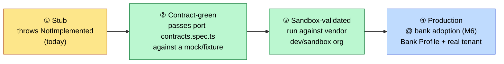
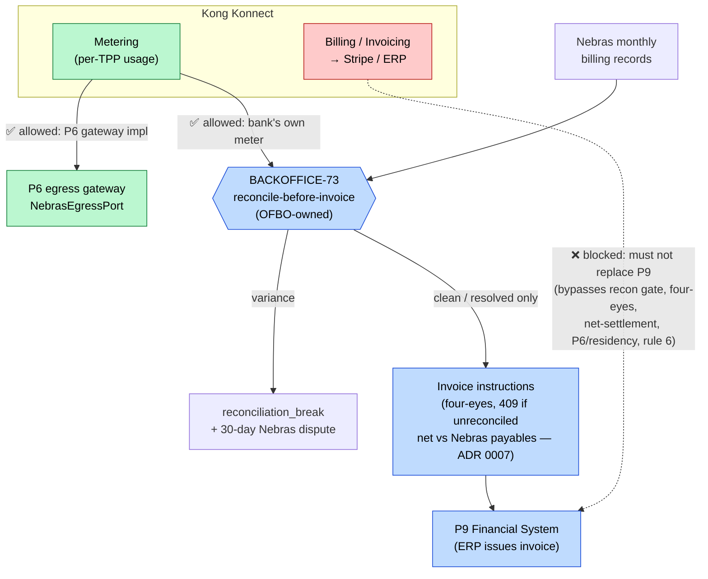

# ADR 0023 — Pre-stage enterprise port adapters ahead of M6; Kong Konnect metering-vs-invoicing boundary

- Status: **Proposed** — awaiting human decision (a build-order deviation from M6, plus a vendor-platform boundary that touches P6/P9 and the reconcile-before-invoice control)
- Date: 2026-06-26
- Related: PRD §3 (ports model) + §3.1 (deployment profiles & adapters); `packages/ports/src/interfaces.ts` (the nine port contracts); `packages/ports/src/registry.ts` (`getAdapter` — the single profile-selection point); `packages/ports/test/port-contracts.spec.ts` (the M6 port-swap acceptance gate); ADR 0007 (TPP-of-record payables / net settlement — same P9/reconciliation surface); ADR 0017 (agent-first MCP gateway — prior "compose, don't invent a platform" precedent); BACKOFFICE-72 (P9 counterparty registration), BACKOFFICE-73 (monthly TPP invoicing — **reconcile before invoice**); CLAUDE.md "Ports", "Deployment profiles & adapters", and rule 6 (compose, don't invent)

## Context

Two related questions came up about getting ahead of the M6 enterprise port-swaps:

1. **Can we pre-build enterprise adapters for likely vendors** — e.g. Salesforce
   Service Cloud (a **P1** CRM-resident care console, the explicit "alternative" in
   PRD §3) and ServiceNow (**P3** ITSM & alerting) — against their real APIs, *before*
   the bank-adoption milestone (M6) that currently owns them?
2. **Can Kong Konnect's new Metering & Billing capability** (GA Q4 2025, built on Kong's
   OpenMeter acquisition: usage metering, invoice generation, push to Stripe/ERP) be
   adopted for OFBO's billing/metering/invoicing?

The architecture already anticipates (1): every port is one interface with two adapter
implementations (`sim` / `enterprise`), and `registry.ts::getAdapter` is the **only**
place profile selection happens — core code never branches on profile. Today the
enterprise branch is a hard stub:

```ts
// packages/ports/src/registry.ts
export function getAdapter<K extends PortName>(port: K, profile: DeployProfile): PortMap[K] {
  if (profile === 'enterprise') throw new EnterpriseAdapterNotImplementedError(port)
  return SIM_ADAPTERS[port]
}
```

So pre-staging an enterprise adapter is **adapter replacement, not a new primitive** —
it does not, on its own, need an ADR on architectural grounds. What *does* need a human
decision is the **timing** (pulling M6 work forward, ahead of the PRD §9 build order) and
the **Kong boundary**, where "use Kong for billing" can quietly cross from "a metering
*input*" into "replace the regulated P9 invoicing workflow" — which is a new platform
billing/approval mechanism and therefore a rule-6 stop.

Per CLAUDE.md rule 6, both the build-order deviation and the vendor-platform boundary are
humans-decide items, hence this ADR.

## Requirements & regulatory basis

- **Port discipline (PRD §3).** The core never references a vendor; bank-specifics live in
  configuration / the Bank Profile. A pre-staged adapter must not leak the vendor's object
  model into core code or the port interface.
- **Port-swap acceptance gate (M6 / PRD §3.1).** An enterprise adapter "must pass exactly
  the tests the simulator passes" — `packages/ports/test/port-contracts.spec.ts` binds
  *both* adapters. This is the objective bar for "done enough."
- **Demo profile is permanently non-prod, synthetic-only, free-tier.** No real Salesforce/
  ServiceNow/Kong tenant may ever be wired into the demo deployment (zero-PII hard stop).
- **Reconcile-before-invoice is binding (BACKOFFICE-73).** Pipeline order is mandatory:
  ingest Nebras billing → reconcile against the **bank's own metering** (Nebras figures are
  never blindly trusted) → variances become `reconciliation_break` + a 30-day Nebras dispute
  → only clean/resolved lines invoice; disputed lines are withheld. Invoice runs are
  four-eyes-gated (409 if unreconciled) and net-settle against Nebras payables (ADR 0007).
- **P6 egress is non-negotiable.** ALL Nebras-bound traffic rides the bank's egress gateway;
  any vendor billing push to an external payment processor (e.g. Stripe) is a separate egress
  path with UAE data-residency implications.

## Decision A — Pre-staging enterprise adapters ahead of M6

Allow enterprise adapters to be authored **before** their M6 swap, as a de-risking
activity, **bounded by a fidelity ladder and four guardrails**.

### The fidelity ladder (what "pre-staged" honestly means)



**Pre-staging gets us to ③ at most.** ④ cannot be reached pre-adoption because auth
(Salesforce connected-app / ServiceNow OAuth), data residency, and the bank's actual
routing/field config are theirs. The value is real but bounded: most of the adapter code
and *all* of its contract tests exist before M6, so the M6 integration is configuration +
sandbox→prod promotion, not a from-scratch build. We market it as **de-risking M6, not
eliminating it.**

### Guardrails (non-negotiable for any pre-staged adapter)

1. **Implement the port interface, nothing more.** `ItsmPort.createTicket(type, severity,
   team, summary)` is one method; ServiceNow exposes hundreds. An adapter that mirrors the
   vendor's object model is a leak. Surface area = the port contract, full stop.
2. **Green against `port-contracts.spec.ts` — the same suite the sim passes.** If a
   pre-staged adapter cannot go green against the existing contract tests, the *interface*
   is wrong, not the test (fix via the normal spec-first route, never by weakening the test).
3. **Bank-specifics stay in configuration / the Bank Profile** — OAuth client config, queue/
   team routing, object & field mappings. None hardcoded; core never branches on profile.
4. **Never wire a real tenant into demo.** Pre-staged adapters ship as code + contract tests
   + an out-of-band sandbox harness, exercised against a vendor *developer/sandbox* org —
   never the demo deployment, which stays synthetic and free-tier.

### Initial candidates (illustrative, not a commitment)

| Vendor | Port | Interface implemented |
|---|---|---|
| Salesforce Service Cloud | **P1** (CRM-resident care console) | `CareSurfacePort` (`mintCareToken`, `resolveCallRecording`) |
| ServiceNow | **P3** ITSM & alerting | `ItsmPort.createTicket` |
| Kong Konnect | **P6** egress gateway (+ metering feed, see Decision B) | `NebrasEgressPort` |

## Decision B — Kong Konnect: metering is an input, invoicing stays in OFBO

Adopt Kong Konnect **metering** as a candidate *input* (a P6 egress-gateway implementation
and/or the bank's own per-TPP meter feeding E1 reconciliation). **Do not** adopt Kong's
**billing/invoicing** as a replacement for P9 — the regulated reconcile-before-invoice
workflow stays inside OFBO; the bank's ERP (P9) remains the invoice issuer.



**Why metering fits.** BACKOFFICE-73 step 2 *requires* an independent counter — the bank's
own per-TPP metering — to reconcile Nebras's figures against ("Nebras figures are never
blindly trusted"). If Kong is the bank's gateway, its usage metering is exactly that counter.
Kong as the **P6** egress gateway (implementing `NebrasEgressPort`) with metering as a bonus
reconciliation feed is the most natural single fit.

**Why billing/invoicing must not replace P9.**

- **It bypasses the recon gate.** Kong's model is "generate invoice at cycle end → push to
  Stripe." OFBO's is the inverse: nothing invoices until it is reconciled clean or the
  variance is resolved; disputed lines are *withheld*. That gate is regulated domain logic.
- **It can't express four-eyes + net-settlement.** Invoice runs are four-eyes-gated (409 if
  unreconciled) and net against Nebras payables where the bank is TPP-of-record (ADR 0007) —
  not representable as vendor pricing rules.
- **Egress / residency.** A Stripe/ERP push is a separate egress path; P6 mandates all
  Nebras-bound traffic via the bank's gateway, and UAE residency governs regulated data.
- **Rule 6.** Adopting a SaaS billing engine as the invoicing mechanism is a new platform
  billing/approval primitive — a humans-decide stop, not a drop-in.

## Options considered

1. **Pre-stage adapters under the fidelity ladder + Kong-metering-only boundary (recommended).**
   De-risks M6 using primitives that already exist; keeps the regulated invoicing workflow in
   OFBO. **Cons:** spends build effort ahead of the milestone; pre-staged adapters carry a
   maintenance cost if the port interface evolves before M6.
2. **Wait for M6 (status quo).** No early work; every enterprise adapter is built at adoption.
   **Cons:** forgoes cheap, contract-test-backed de-risking; concentrates integration risk at
   the milestone. Safe but leaves value on the table.
3. **Adopt Kong end-to-end, including billing/invoicing as P9.** **Rejected** — bypasses the
   reconcile-before-invoice gate, four-eyes, net-settlement, and P6/residency; a rule-6 new
   primitive. The metering half is kept (folded into Option 1); the billing half is out.

## Recommendation (for the human to confirm)

**Option 1.** Permit pre-staging of enterprise adapters to ladder rung ③ under the four
guardrails, and treat Kong Konnect as a **metering/P6 input** while keeping P9 invoicing —
and the reconcile-before-invoice control — inside OFBO.

## Decision

_Pending._ Once chosen: (a) add a backlog item recording the **build-order deviation**
(pre-M6 adapter work) so the PRD §9 milestone order has the exception on record;
(b) pick the first 1–2 pre-stage candidates (P3 ServiceNow / P1 Salesforce); (c) if Kong is
in scope, raise a requirement for a Kong-metering reconciliation feed (extends BACKOFFICE-73
step 2) and/or a Kong `NebrasEgressPort` (P6) adapter — both tests-first against
`port-contracts.spec.ts`.

## Consequences

- Pre-staged adapters reach **rung ③ (sandbox-validated)** at most; M6 still owns the
  tenant/residency/Bank-Profile final mile — communicated as de-risking, not elimination.
- Adapters that drift from an evolving port interface must be re-greened against
  `port-contracts.spec.ts` before M6 — a maintenance cost we accept knowingly.
- **No new platform primitive** is introduced: pre-staging reuses the existing
  port/registry/contract-suite machinery; Kong enters only as a P6/metering *input*, with the
  regulated P9 invoicing workflow untouched (rule 6 honoured).
- **Soft-relates to ADR 0007** — both touch the P9 + reconciliation surface; a Kong metering
  feed should reconcile symmetrically across receivables and (0007's) payables.
- **Bank decisions required:** which vendors to pre-stage, and whether Kong is the bank's
  gateway/meter (it is bank-estate, not an OFBO choice).
```
