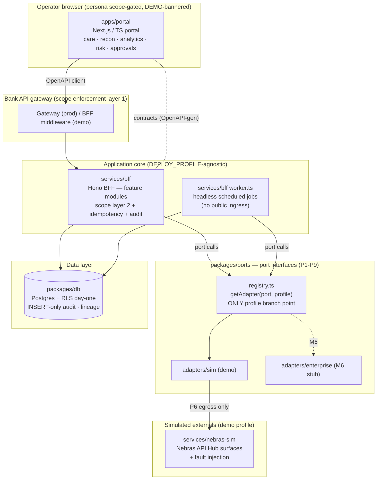
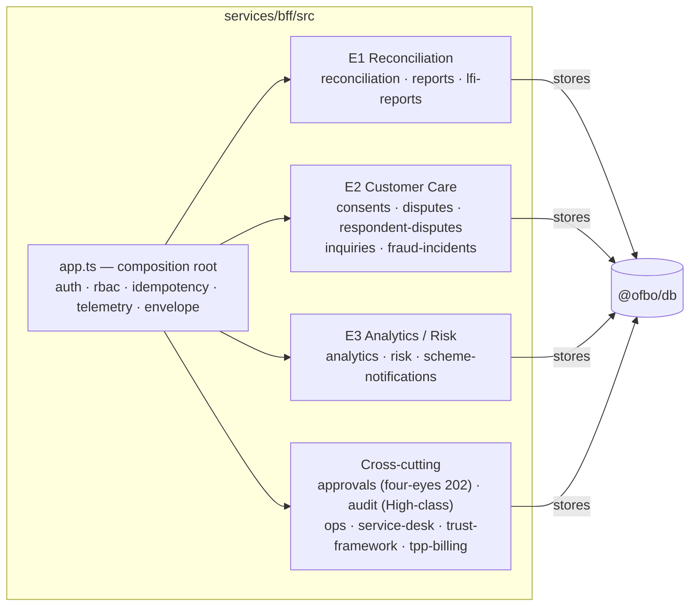

# OFBO — Component Architecture

> Auto-generated overview of the Open Finance Back Office monorepo. Layout: pnpm
> workspace (`apps/*`, `services/*`, `packages/*`). Division of truth: Stitch =
> layout/tokens; `specs/backoffice-openapi.yaml` = behaviour/data.

## 1. System context (who talks to what)



## 2. Ports (P1–P9) — every external system is an interface

`packages/ports/src/interfaces.ts` defines the contract; `registry.ts` is the
**only** place `DEPLOY_PROFILE` is read. Core code calls `getAdapter(port, profile)`
and never branches on profile itself.

| Port | Interface | Purpose |
|------|-----------|---------|
| P1 | `CareSurfacePort` | Customer-care surface — short-lived act+sub tokens |
| P2 | `IdentityProviderPort` | Enterprise IdP (OIDC), MFA |
| P3 | `ItsmPort` | ITSM / alerting ticket creation |
| P4 | `CoreBankingPort` | Read-only reconciliation inputs |
| P5 | `ApmPort` | Enterprise APM bridge off the OTel stream |
| P6 | `NebrasEgressPort` | **ALL** Nebras-bound traffic — no direct egress |
| P7 | `LineagePort` | BCBS 239 column-level lineage at write time |
| P8 | `OnboardingHandoverPort` | Bank onboarding handover funnel events |
| P9 | `FinancialSystemPort` | TPP counterparty registration + invoicing |

Two adapters per port behind one interface: `sim` (demo) + `enterprise` (M6
port-swap). Contract tests bind both — that's the port-swap acceptance gate.

## 3. BFF feature modules (services/bff/src)

Each module = `service.ts` (logic + `InMemory*Store` default) + `routes.ts`
(Hono handlers) wired into `app.ts` (`AppDeps`, `IMPLEMENTED_ROUTES`). The
`worker.ts` re-wires the same services with Postgres-backed stores for jobs.



### Headless jobs (`worker.ts`, no public ingress)
- Three-way **Reconciliation Engine** (daily, BACKOFFICE-01)
- `LiabilityMonitorService` + `LiabilityForecastMonitor` (risk signals → ITSM)
- `CertExpiryMonitor` (cert chain ≤7d → ticket + High-class audit)
- `LfiCadenceMonitor` (16 login-only Nebras reports → cadence-missed signal)

## 4. Data layer (packages/db)

One store class per resource (`*-store.ts`), all RLS-enabled from day one, with
`audit.ts` (INSERT-only `audit_high_sensitivity`), `lineage.ts` + `lineage-gate.ts`
(Q4.5 BCBS 239), `retention.ts` (24-month hot / 5-year immutable), and
`classification.ts`. Migrations in `packages/db/migrations` (0001 → 0025).

## 5. Shared packages

| Package | Role |
|---------|------|
| `@ofbo/contracts` | OpenAPI-generated types + routes (`*.generated.ts`), `matchRoute` |
| `@ofbo/ports` | Port interfaces + registry + sim adapters |
| `@ofbo/db` | Postgres stores, audit, lineage, retention, RLS |
| `@ofbo/redaction` | PII redaction at emission |
| `@ofbo/synthetic-data` | Deterministic synthetic UAE OF v2.1 fixtures |
| `@ofbo/release-evidence` | CI quality-gate evidence bundle (Q1–Q5) |
```

