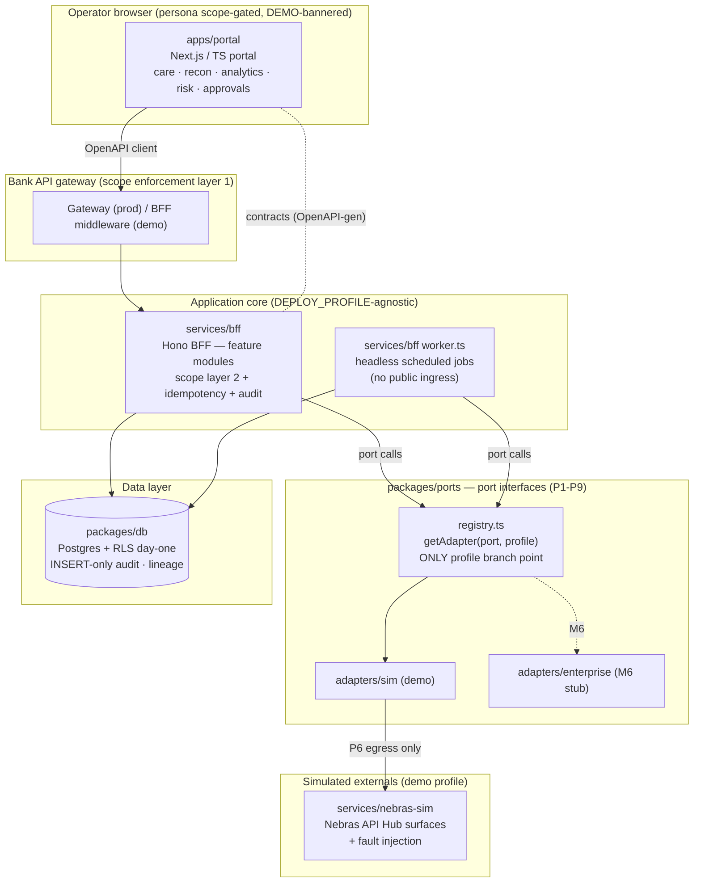
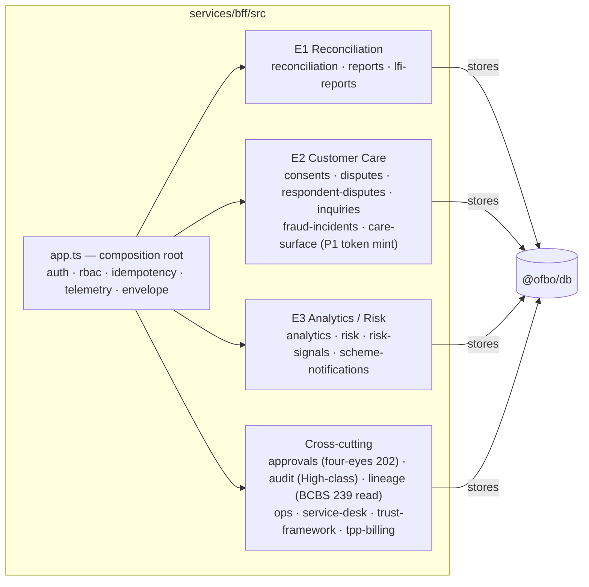
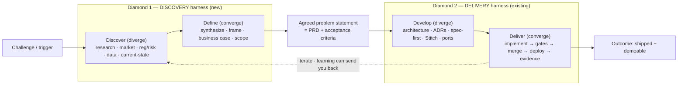
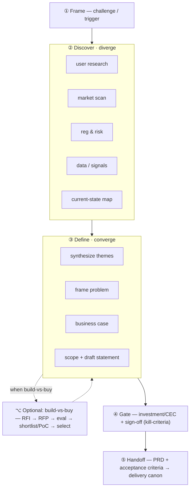

# OFBO — Component Architecture

> Auto-generated overview of the Open Finance Back Office monorepo. Layout: pnpm
> workspace (`apps/*`, `services/*`, `packages/*`). Division of truth: Stitch =
> layout/tokens; `specs/backoffice-openapi.yaml` = behaviour/data.

## 1. System context (who talks to what)



## 2. Ports (P1–P9) — every external system is an interface

`packages/ports/src/interfaces.ts` defines the contract; `registry.ts` is the
**only** place `DEPLOY_PROFILE` is read. Core code calls `getAdapter(port, profile)`
and never branches on profile itself.

| Port | Interface | Purpose |
|------|-----------|---------|
| P1 | `CareSurfacePort` | Customer-care surface — short-lived act+sub tokens |
| P2 | `IdentityProviderPort` | Enterprise IdP (OIDC), MFA |
| P3 | `ItsmPort` | ITSM / alerting ticket creation |
| P4 | `CoreBankingPort` | Read-only reconciliation inputs |
| P5 | `ApmPort` | Enterprise APM bridge off the OTel stream |
| P6 | `NebrasEgressPort` | **ALL** Nebras-bound traffic — no direct egress |
| P7 | `LineagePort` | BCBS 239 column-level lineage at write time |
| P8 | `OnboardingHandoverPort` | Bank onboarding handover funnel events |
| P9 | `FinancialSystemPort` | TPP counterparty registration + invoicing |

Two adapters per port behind one interface: `sim` (demo) + `enterprise` (M6
port-swap). Contract tests bind both — that's the port-swap acceptance gate.

## 3. BFF feature modules (services/bff/src)

Each module = `service.ts` (logic + `InMemory*Store` default) + `routes.ts`
(Hono handlers) wired into `app.ts` (`AppDeps`, `IMPLEMENTED_ROUTES`). The
`worker.ts` re-wires the same services with Postgres-backed stores for jobs.
**Twenty feature modules** today — newest: `care-surface` (P1 short-lived act+sub
token minting, BACKOFFICE-25), `lineage` (column-level BCBS 239 read for Compliance,
BACKOFFICE-49), `risk-signals` (Risk analyst triage surface, BACKOFFICE-30/-42), and
`GET /disputes/{id}/call-recording` (call/transcript linkage, BACKOFFICE-64).



### Headless jobs (`worker.ts`, no public ingress)
- Three-way **Reconciliation Engine** (daily, BACKOFFICE-01)
- `LiabilityMonitorService` + `LiabilityForecastMonitor` (risk signals → ITSM)
- `CertExpiryMonitor` (cert chain ≤7d → ticket + High-class audit)
- `LfiCadenceMonitor` (16 login-only Nebras reports → cadence-missed signal)

## 4. Data layer (packages/db)

One store class per resource (`*-store.ts`), all RLS-enabled from day one, with
`audit.ts` (INSERT-only `audit_high_sensitivity`), `lineage.ts` + `lineage-gate.ts`
(Q4.5 BCBS 239), `retention.ts` (24-month hot / 5-year immutable), and
`classification.ts`. Migrations in `packages/db/migrations` (0001 → 0025).

## 5. Shared packages

| Package | Role |
|---------|------|
| `@ofbo/contracts` | OpenAPI-generated types + routes (`*.generated.ts`), `matchRoute` |
| `@ofbo/ports` | Port interfaces + registry + sim adapters |
| `@ofbo/db` | Postgres stores, audit, lineage, retention, RLS |
| `@ofbo/redaction` | PII redaction at emission |
| `@ofbo/synthetic-data` | Deterministic synthetic UAE OF v2.1 fixtures |
| `@ofbo/release-evidence` | CI quality-gate evidence bundle (Q1–Q5) |

## 6. Discovery → delivery: the double diamond

The build harness in §7 is the *delivery* half of the process — it assumes you already
know **what** to build (the PRD). Discovery is the half that produces that PRD. Framed
against the Design Council's **Double Diamond**, the whole flow is two diamonds —
**Discover → Define** (the problem) then **Develop → Deliver** (the solution). Each
diamond diverges (explore widely) then converges (decide). They meet at the **agreed
problem statement / PRD** — the output of discovery and the input (canon) of delivery.
It is non-linear: evidence found late can send you back a diamond.



### Discovery harness (Diamond 1) — from challenge to PRD

One discovery per opportunity, evidence-first, with a kill-switch. Stages:

1. **Frame** the challenge — strategy/OKRs, a regulatory mandate, a customer/market signal, an exec sponsor ask, or a pain point/incident.
2. **Discover (diverge)** — gather evidence, not solutions: stakeholder & user research, market & competitor scan, regulatory & risk landscape (discovery-mode risk review), data & signal analysis, current-state journey mapping.
3. **Define (converge)** — synthesize evidence into insight themes, frame the problem ("How might we…"), build the **business case** (NPV/IRR, cost-benefit, options), prioritise & scope, and draft the problem statement.
   - **Optional RFP branch (build-vs-buy):** when discovery surfaces a capability gap, run RFI → RFP → scored (weighted) evaluation → shortlist + PoC/demo → partner selection; the vendor-shaped constraints fold back into the problem statement.
4. **Gate** — investment / CEC committee approval + problem-statement sign-off. This is the four-eyes of discovery; **kill-criteria** can stop here (a discovery is allowed to fail).
5. **Handoff** — the agreed problem statement becomes the **PRD + acceptance criteria** (plus any selected partner) and seeds the delivery canon (`CLAUDE.md` · PRD · OpenAPI · `backlog.yaml`).

**Discovery guardrails** (the analog of the delivery hard-stops): evidence over assertion (every claim cites a signal), people-centred (real users in the loop), visualize & make tangible, explicit kill-criteria, and early regulatory/risk feasibility so no dead-end problem reaches delivery.



## 7. Build harness (Diamond 2 — delivery) — how OFBO is built end-to-end

The repo is built by an AI-DLC story loop on top of a quality-gated CI/CD pipeline.
Canon is `CLAUDE.md` + `docs/PRD_Open_Finance_Back_Office.md` +
`specs/backoffice-openapi.yaml` + `docs/backlog.yaml` (BACKOFFICE-01..80). One story
per branch, spec-first, demoable on merge.

```mermaid
flowchart LR
    Canon["Canon (ground truth)<br/>CLAUDE.md · PRD · OpenAPI · backlog.yaml"]
    subgraph Author["① AUTHOR — isolated git worktree"]
        direction LR
        S1["Story → worktree<br/>feature/BACKOFFICE-NN<br/>EnterWorktree · bgIsolation"]
        S2["Spec-first<br/>OpenAPI path → pnpm gen<br/>contract test FAILS first"]
        S3["Implement → green<br/>routes→service→store/port<br/>scope ×2 · audit+lineage · ≥80%"]
        S4["Local reviewers<br/>contract-conformance<br/>hard-stop agent"]
        S1 --> S2 --> S3 --> S4
    end
    subgraph Gates["⑤ CI gates (ci.yml) — failed gate blocks merge"]
        direction LR
        Q1["Q1 build+unit"] --> Q2["Q2 static+SAST"] --> Q3["Q3 integ+contract+E2E"] --> Q4["Q4 security+deps"] --> Q45["Q4.5 BCBS 239 lineage"]
    end
    Merge["⑥ Four-eyes merge → main<br/>HG-0001 · human approves"]
    Deploy["⑦ Auto-deploy (deploy.yml)<br/>seed · BFF+Portal→Cloudflare<br/>Nebras→Railway · smoke vs LIVE url"]
    Rel["⑧ Release evidence (on release)<br/>re-run gates · lineage proof<br/>sealed bundle → releases/&lt;tag&gt;/"]

    Canon --> S1
    S4 -->|open PR| Q1
    Q45 -->|all green| Merge --> Deploy
    Deploy -. on release .-> Rel
```



**Authoring guardrails (enforced).** `.claude/settings.json` sets
`worktree.bgIsolation="worktree"` (background sessions are hard-blocked from
editing the main checkout until `EnterWorktree`). Hooks in `.claude/hooks/` run on
every session and Edit/Write: `worktree-policy` (SessionStart reminder),
`pii-guard` (blocks `784…` Emirates IDs / real-shaped IBANs), and `spec-tripwire`
(locks `specs/backoffice-openapi.yaml` mid-feature — the contract changes only via a
dedicated spec PR). Pre-PR, two subagents review the diff: `contract-conformance-reviewer`
(spec fidelity) and `hard-stop-reviewer` (scope matrix, audit immutability, PII,
egress, four-eyes, profile branching). `Q5` (manual prod approval) is evidenced at
release time via `release-evidence.yml`, not on every PR.

## 8. The regulated-entity brain — training the model on the institution

A regulated entity is not generic, so the model cannot be either. When the model is
dropped into an institution it has to be **trained on it** — given the context that
makes that entity what it is: how it works, how it words things, how it abbreviates,
and how it is regulated. That context is a first-class asset — a **regulated-entity
brain** the harnesses read from at every step and write back to after every cycle.

- **Seeded** from what the entity already has — policies & standards, governance & org structure, glossaries & house style, regulator mandates, system & vendor inventory, past decisions.
- **Two layers** — *general practice* ships with the model (conventions, security posture, regulatory patterns: four-eyes, INSERT-only audit, lineage); *entity-specific context* is built up over time (ways of working, terminology & wording, abbreviations & acronyms, regulatory specifics, systems & ports mapping, personas & scopes, risk taxonomy, decisions/ADRs).
- **One governed home** — versioned in the repo: `CLAUDE.md` (binding conventions), the memory store, ADRs (decisions), and configuration (the entity's port mappings). A single source of truth, not tribal knowledge.
- **Compounds every cycle** — each discovery and delivery deposits new context, so onboarding the next solution gets faster, safer and more clearly the entity's own.

The model is generic by design and therefore copyable; the trained brain is not. It is
the moat — where general best practice and the institution's own identity meet, turning
"a way to build" into *this regulated entity's* way of building. See
`docs/diagrams/entity-brain.svg`.

## 9. Diagrams

Standalone SVGs in `docs/diagrams/`:

| File | What it shows |
|------|---------------|
| `double-diamond.svg` | The whole process as two diamonds — discovery + delivery |
| `discovery-harness.svg` | Discovery harness (Diamond 1) — challenge → agreed PRD |
| `entity-brain.svg` | The regulated-entity brain — context that adapts the model |
| `architecture.svg` | Layered runtime architecture (portal → BFF → ports → externals) |
| `dependency-graph.svg` | Internal pnpm workspace import edges |
| `fraud-revoke-sequence.svg` | Four-eyes fraud-revoke flow (BACKOFFICE-22) |
| `build-harness.svg` | End-to-end delivery harness (§7, expanded) |
```

