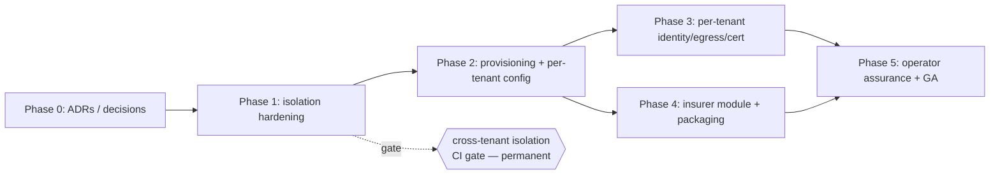

# Multitenant Platform Blueprint — operating OFBO as a shared UAE Open Finance utility

- Status: **Proposed — discussion draft for human decision** (composes with CLAUDE.md rule 6: multitenancy is a
  cross-cutting change, so this document *plans and decides*, it does not implement).
- Date: 2026-07-21
- Relates to: **ADR 0026** (commercial positioning — hosted-SaaS motion), backlog **COMMERCIAL** track
  (VAL-01, HOST-01/02/03, INS-01/02), **ADR 0006** (LFI↔TPP wall), **ADR 0007** (payables/net-settlement),
  **ADR 0015** (governed cross-fintech aggregation), governance **HG-0002/0004/0005/0010/0011**, PRD §2/§3/§5/§8/§10.
- Scope: how to turn the single-tenant demo into a multi-institution ("Leviathan") platform for Tier-2 banks,
  Tier-1/2 insurers and the mandated long tail — **regulatory operating model first**, architecture second.

---

## 0. TL;DR

CBUAE Circular **C 03/2025 mandates Open Finance for ~50 banks and 60+ insurers/brokers** (plus exchange houses),
most of whom cannot build any of this and all of whom face the same release deadlines and the same per-event
liability schedule. That is the "Leviathan": a shared compliance-and-assurance utility the long tail plugs into
instead of building. ADR 0026 already blessed this as a live commercial motion; this blueprint is the *how*.

The single most important finding, stated plainly:

> **The data plane is already multi-tenant; the control plane does not exist; and the one deliberate
> RLS-bypass path silently becomes a cross-customer data leak the moment a second customer lands.**

- **Data plane — ready.** Every regulated table carries `bank_id uuid NOT NULL` with `FORCE ROW LEVEL SECURITY`
  from day one (`packages/db/migrations/0002_tables.sql`, `0003_rls.sql`). RLS can already isolate N tenants.
- **Control plane — absent.** The tenant is a *deploy-time constant*: one `BANK_ID` env var read once at Worker
  boot and frozen into ~30 stores (`services/bff/src/worker.ts:105`). No tenant identifier travels on the request
  or in any token claim — the authenticated principal knows *who* and *what scopes*, never *which institution*
  (`services/bff/src/auth.ts:48`, `packages/ports/src/interfaces.ts:20`).
- **The trap.** `bank_internal_view` is a `USING (true)` SELECT role that reads **across every `bank_id`**
  (`packages/db/src/tenant-tx.ts:28`). Today that means "one bank aggregating across the fintechs it hosts" — a
  governed feature (ADR 0015). Under a shared operator the *same code path* reads across **competing
  institutions**. Re-scoping it (**HOST-02**) is the non-negotiable prerequisite before tenant #2 exists.

**Four constraints change *meaning* — not just configuration — under a shared operator**, and none is solved by
current code:

1. The `bank_internal_view` bypass becomes **cross-institution**, not cross-fintech-within-one-bank.
2. The operator shifts from PDPL **Controller** to **Processor** for each tenant — **PDPL Art 8 joint
   liability** + CBUAE **Outsourcing C 14/2021** duties attach to the operator.
3. Residency and the FAPI-2.0 certificate/egress identity must be **per-institution**, not one IaC region
   parameter and one shared P6 gateway.
4. A failure of the *shared* platform still crystallises as a **liability event against the specific
   tenant-institution** — the scheme's liability schedule has no "operator" party.

Everything else (RLS, INSERT-only audit, 5-year retention, P6 single egress, consent-only-in-Hub, the scope
matrix, 202/four-eyes, the governed-aggregate machinery) is **reusable substrate**. This is a hardening-and-
provisioning programme, not a rewrite — but it has a strict ordering, and steps 1–4 above are load-bearing.

---

## 1. The opportunity and who the tenants are

### 1.1 The mandate creates the market
Per ADR 0026 and `services/bff/src/analytics/programme.ts` (the CBUAE mandatory-release calendar): the tail is
mandated, deadline-bound (R4+ Apr 2026, Corporate R5 Sep 2026, Insurance data-sharing onboarding 2026-Q3, CAAP
migration 2026-Q4) and largely without engineering capacity. Compliance is not optional for them, and building
it is infeasible for most — the textbook condition for a shared utility.

### 1.2 Tenant taxonomy
Each tenant is itself **dual-role** (README, PRD §1): an **LFI** (holds PSU accounts, serves inbound consented
TPP traffic) **and** a **TPP-of-record / TPP-as-a-Service** (consumes other LFIs' data, a billable reconciled
counterparty). The platform runs both hats for every tenant.

| Segment | Isolation tier (see §2.3) | Packaging (ADR 0026) | Notes |
|---|---|---|---|
| **Tier-2 banks** | Pooled shared-schema-RLS; dedicated cell on request | Hosted SaaS (assurance) + optional console | The core hosted-SaaS motion |
| **Tier-1/2 insurers & brokers** | Pooled; dedicated cell for large carriers | Hosted SaaS + INS module | INS-01/02; Takaful variant (see §4) |
| **Exchange houses** | Pooled | Console tier via Nebras | Segment named in the VAS pitch |
| **Long-tail fintechs** | Pooled | Console tier (free/bundled via Nebras, CAAP model) | The "raise scheme compliance" cohort |
| **Tier-1 banks** | Dedicated DB / their own estate (M6) | Enterprise deploy-and-integrate | Later upmarket motion; the readiness wizard already sizes this |

### 1.3 Two products on one codebase (the ADR-0026 split, restated for tenancy)
The conflict-of-interest fault line is a **packaging constraint that multitenancy must respect**:

- **Console tier** (non-adversarial: consent ops + care, participant-side dispute case management, mandatory
  reporting with integrity hashes, STR/AML trail, audit/retention). White-labellable ("Al Tareq Operations
  Console"), distributable *through Nebras*.
- **Assurance tier** (adversarial-by-design: three-way reconciliation, fee/invoice verification, liability
  monitor + forecast, scheme-SLA observability, TPP-aaS margin). Sold **direct**, never through Nebras — *"the
  scheme gives you the console; only an independent party can audit the scheme."*

Multitenant implication: a tenant's subscription tier must be a **per-tenant capability flag** that gates whole
module families — done in configuration and scope-gating (compose-don't-invent), never a code fork.

---

## 2. The tenancy model (target architecture)

### 2.1 What "tenant" means today (precise)
- `bank_id` (a UUID) is the **RLS isolation unit**. It denotes a *licensed entity*.
- A customer may be a **group** of licensed entities (PRD §3, BD-12: "single entity, or multiple licensed
  entities in a group, each with separate LFI certification"). Today the demo is one entity, `DEMO_BANK_ID =
  11111111-1111-4111-8111-111111111111`.
- The **fintechs** a bank serves as TPP-of-record are *not* separate tenants — they are modelled *within* a
  `bank_id` via the `channel` enum (`external_tpp_aas`), the `client_id` column, and the `tpp_counterparty`
  registry. "Cross-fintech aggregation" therefore means *within one customer*, across its channels/clients.
- `bank_internal_view` aggregates across `bank_id` for that one customer's internal reporting.

### 2.2 Target tenancy hierarchy
Introduce **the tenant/customer as a first-class concept above `bank_id`**, without disturbing the RLS unit:

```
Operator (the platform runner — a PDPL Processor / outsourced service provider)
  └─ Tenant / Customer  (an adopting institution; a "tenant group" of one or more licensed entities)
        └─ bank_id       (a licensed entity — the RLS isolation unit, unchanged)
              └─ channel / client_id / tpp_counterparty  (the fintech & product relationships within an entity)
```

Mechanically this is the **tenant-group membership table** already named by HOST-02: a mapping
`tenant_group → {bank_id…}`, RLS-guarded, so that:
- **`ofbo_app`** stays pinned to a single `bank_id` per transaction (unchanged; `beginAppTx`).
- **`bank_internal_view`** stops being `USING (true)` and instead reads only the `bank_id`s belonging to the
  caller's tenant group — "cross-fintech within a customer" is preserved; "cross-customer" is made impossible.
- The demo bank becomes a **single-member group**, so all current behaviour and tests hold.

### 2.3 The isolation-model decision (a required ADR)
"Shared platform" does not mean "one shared everything." Choose a **tiered isolation model**, not a single
posture:

| Model | Isolation strength | Cost / ops | Fit |
|---|---|---|---|
| **Pooled — shared schema, RLS by `bank_id`** | Logical (RLS + re-scoped bypass) | Lowest; near-zero marginal cost per tenant | **Default** for console-tier / long-tail / Tier-2 |
| **Bridge — shared DB, schema-per-tenant** | Stronger namespace isolation | Medium; migration fan-out | Tenants wanting DB-level separation without a dedicated instance |
| **Silo — DB-per-tenant / cell-per-tenant** | Physical | Highest; per-tenant provisioning | Tier-1, high-sensitivity carriers, or a regulator-required boundary |
| **Region cell** | Physical + residency | Per-region infra | **Residency** grouping (a cell per approved region) |

Recommendation: **pooled shared-schema-RLS as the default**, with **silo/cell as a per-tenant upgrade** and
**region cells for residency**. This preserves the near-zero-marginal-cost claim that makes the long tail viable,
while giving large/sensitive tenants a hard boundary and satisfying per-tenant residency. Terraform's region is
already validated against an `approved_residency_regions` allow-list (`infra/terraform/`) — the change is making
region a *per-cell* value rather than one global apply.

### 2.4 The control-plane gap (tenant must become a request property)
Tenant identity must move from *deploy-time constant* to a **verified, per-request property of the authenticated
principal**. The concrete seam is `createAuthMiddleware` (`services/bff/src/auth.ts`), alongside scope minting.
The 13 single-tenant assumptions (full index in the Appendix) collapse into four changes:

1. **Credential carries tenant.** Add a `bank_id` (or `tenant_id → bank_id`) claim to `verifyToken` and
   `verifyAgentSession` (`packages/ports/src/interfaces.ts`); both sim and Entra adapters map it exactly as they
   already map persona. For agents, bind the *registration's* tenant into the minted session (the
   `agent_registry` row is already `bank_id`-partitioned — `0027_agent_registry.sql:13` — but the token drops it).
2. **`Principal` carries tenant.** Add the resolved `bank_id` to `Principal` / `AgentPrincipalContext`; set it in
   auth middleware.
3. **Stores bind tenant per-request, not per-construction.** Today ~30 `Pg*Store` constructors freeze one
   `tenancy` object (`worker.ts:110-141`) and every `beginAppTx(this.config.bankId)` reads it. Introduce a
   per-request store/connection factory (or thread `bankId` into each call). **This is the largest surface.**
4. **Headless jobs iterate tenants.** `scheduled()` (`worker.ts:190-278`) runs reconciliation, ingestion,
   liability, anomaly, cert-expiry and cadence jobs for one bank; it must loop over a tenant registry (there is
   no request principal to derive tenant from) — idempotently, one isolated transaction per tenant.

**Anti-pattern to avoid:** the existing `OFBO_TRAINING` short-circuit (`worker.ts:98`) selects an isolated app
*by deploy config, never per request*. That is the correct pattern for a *mode*, and the **wrong** pattern for
*tenancy* — tenants must coexist in one deployment, so tenant selection must be per-request, not a boot-time fork.

---

## 3. The regulatory operating model (the core of this plan)

The binding constraints are already encoded for **one** tenant. This section is about what it takes to *operate
the platform* for **many** — the user's central question.

### 3.1 Controller → Processor: the operator's new legal identity
- **Single-tenant today:** the adopting bank is the **PDPL Controller** and the licensed OF participant; it owns
  the full protection duty.
- **Hosted:** the operator becomes a **Processor** for each institution-Controller. Per the data-risk register
  (`DR-2.8-002`), **PDPL Article 8 creates joint liability with processors** — the operator's non-compliance
  directly exposes each tenant, and vice versa. This activates the third-party-processor controls
  **CTRL-DP-024/025/026**.
- **The operator never becomes a licensed OF participant.** Each tenant remains the LFI/TPP-of-record on the
  scheme; the operator runs the back office *on the tenant's behalf* under an outsourcing agreement. The consent
  and FAPI planes stay the tenant's (see §3.3, §3.4).
- **CBUAE Outsourcing Regulation C 14/2021** governs the arrangement (material outsourcing of a regulated
  activity): onshore **master system-of-record**, **no cross-border sharing without prior CBUAE approval + the
  customer's explicit consent**, operator due diligence, **audit & access rights** for the tenant and CBUAE, a
  documented **exit plan**, and **concentration-risk** treatment (many mandated institutions on one operator is
  itself a systemic concern CBUAE will probe).

**Decision required:** the operator's regulatory posture (processor + outsourced-service-provider), the standard
per-tenant outsourcing agreement, and the residency/onshore-SOR commitment. → Raise a Proposed ADR (§8).

### 3.2 Per-tenant data residency and hard cross-tenant isolation
- **Residency is per-institution.** One IaC region parameter is no longer sufficient (`infra/terraform/` binds
  one region per apply). Model residency as **region cells** (§2.3); each tenant is pinned to an approved cell;
  no tenant's Confidential-class data may cross into another cell without that tenant's C 14/2021 approval path.
- **The isolation invariant:** *no tenant's data — in a report, an aggregate MV, an inquiry bundle, an audit
  read, or a lineage record — may ever include another tenant's rows.* `ofbo_app` RLS gives this for pinned
  reads; the **`bank_internal_view` bypass does not** until HOST-02 re-scopes it. This is the P0 item.
- **Per-tenant audit, lineage, retention.** `audit_high_sensitivity` stays INSERT-only at every role (UPDATE/
  DELETE revoked from PUBLIC, `ofbo_app`, `bank_internal_view` — `0003_rls.sql:65`), 24-month hot → 5-year
  immutable (OF Reg C 3/2025 Art 13). Every audit row's tenant must derive from the **request principal's
  tenant**, not the store config (`audit.ts:90` uses `config.bankId` today) — critical for cross-tenant actors
  (operator staff, agents).

### 3.3 The consent invariant holds per tenant
Consent is created, stored, and managed **only in the API Hub / CAAP** — the platform is a synchronised
operational/audit mirror, never the authority (PRD §4.2). The Back Office **never bypasses PSU consent**; admin
actions requiring PSU authority initiate normal Al Tareq flows. Multitenant changes nothing here *except* that
the mirror, the drift check, and the **<5s p99 revoke propagation** must all be **per-tenant**, keyed to each
LFI's Hub identity. There is no shared consent store to leak — isolation is inherent, but it must be enforced at
the per-tenant egress/identity layer (§3.4).

### 3.4 Certificate custody and egress (P6) — the hardest problem
The hard stop is absolute: **all Nebras-bound traffic goes through P6; no direct egress.** Each LFI holds its own
FAPI-2.0 scheme certificate chain (**Root CA → Al Tareq Intermediate → the bank's end-entity**), and *every
certified LFI has its own egress gateway*. So:

- A hosted operator **cannot share one egress identity/cert/gateway across tenants.** Each tenant's traffic must
  terminate on **its own end-entity certificate** through **its own P6 path**.
- **Custody model (HOST-03, human-gated ADR).** Options: (a) **per-tenant KMS/HSM keys** custodied by the
  operator (rotation, revocation, per-use audit); (b) **BYO-egress hybrid** — the tenant keeps its own gateway
  and the operator calls through it (thinnest custody, strongest tenant control); (c) **operator HSM** with
  hardware-partitioned per-tenant keys. Recommend the ADR compare these on residency, rotation/revocation
  lifecycle, **liability allocation** for misuse, and the certificate-use audit trail.
- **A concrete blocker to fix regardless:** the adapter registry memoises enterprise adapters in a cache **keyed
  by port name only** (`packages/ports/src/registry.ts:52`) — it would hand *tenant A's* egress adapter (URL,
  token, cert binding) to *tenant B*. The cache key must include the tenant, and every `*FromEnv` factory
  (`nebras-egress.ts`, `p2-entra.ts`, `core-banking.ts`, `financial-system.ts`) must resolve **per-tenant**
  configuration rather than one global `process.env`. The P2 JWKS verifier is documented as exact-issuer / single
  app-registration (`p2-entra.ts:218`) — multi-issuer tenants need a per-tenant `verifyJwt`.

### 3.5 Liability attribution under a shared operator
The scheme's **Limitation of Liability Model** assigns every event to an **LFI or a TPP — never to a platform
operator** (per-event AED: consent-state failure 500, revocation failure 350, SCA/auth 500, data breach 750, SLA
failure tiered 350/250/200, consumer-protection 1,000, deprecation 2,500, LFI breaking-change 5,000,
fraud-prevention failure 10,000; Nebras's own cap AED 5M/claim). Therefore:

- **A shared-platform failure still lands on the specific tenant** (e.g. a >5s revoke miss caused by the operator
  is *the tenant's* revocation-failure liability to the scheme). The liability monitor (BACKOFFICE-36) must
  **attribute each event to the correct tenant and keep per-tenant thresholds** — a pooled monitor is wrong.
- **The operator needs back-to-back allocation.** The outsourcing agreement (§3.1) must define who bears a
  liability event the *operator* caused, with SLAs and indemnities, plus operator-side SLOs that keep the tenant
  inside the scheme SLAs.
- **This is also the sales wedge:** **VAL-01** turns operating discipline (revokes acked <5s, breaks resolved
  in-SLA, compliant notifications) into an AED **"liability exposure avoided"** KPI. Computed **per tenant**, it
  is the ROI screen that lands hardest with Tier-2/insurer buyers — the reason to be on the utility.

### 3.6 The LFI ↔ TPP Chinese wall (ADR 0006) — now doubly load-bearing
ADR 0006 (still Proposed) notes the dual-role wall is **not modelled**: nothing stops a back-office principal
acting on the TPP side from reading LFI-held PSU data through the back office. The recommended fix is a
`role_domain` (LFI | TPP | shared) dimension on personas, scopes, classification, RLS, plus a
`cross_domain_access` High-class audit event. **Under multitenancy this wall must hold *within* each tenant, and
the cross-*tenant* wall is even more absolute.** Accepting and building ADR 0006 becomes a prerequisite for
representing the platform to CBUAE as enforcing dual-role separation for hosted tenants.

### 3.7 Super-admin, four-eyes, and the scope matrix across tenants
- **Super-admin blast radius.** Today `platform:superadmin` is a marker scope satisfying any check
  (`rbac.ts:23`), capped at ≤2 named individuals per environment, every action High-class audited + auto-raising
  an ITSM ticket and a Risk signal (PRD §2 guardrails, `superadmin.ts`). In a shared platform, one operator
  super-admin over *all* tenants is an enormous cross-institution blast radius. Re-scope to **tenant-scoped
  admin** for routine work and **operator break-glass** for platform incidents, with **per-tenant transparency**
  (each tenant can see, in their own audit, every operator access to their data). Trust in a shared utility is
  won or lost here.
- **Four-eyes across tenants.** Four-eyes requires a *different principal* and rejects self-approval regardless
  of scope. Add the invariant that **an approver from tenant A can never satisfy four-eyes for tenant B** — the
  second approver must belong to the same tenant (or be a defined operator break-glass role, itself audited).
- **The scope matrix gains a tenant dimension.** The persona → scope matrix (`auth.ts:12`) is defined within one
  institution's boundary; scope checks must be evaluated as `(tenant, persona, scope)`, so a valid scope in
  tenant A is meaningless against tenant B's data.

### 3.8 Operator assurance (the operator becomes an audited entity)
A shared operator must itself be certifiable: **SOC 2 Type II**, **ISO 27001**, demonstrable **C 14/2021**
compliance, tenant and CBUAE **right-to-audit**, independent **penetration testing**, and a documented
**concentration-risk / exit / continuity** posture. The immutable-control-plane and kill-switch machinery below
is what makes these provable rather than asserted.

### 3.9 Reusable governance substrate (map, don't reinvent)

| Existing mechanism | Multitenant role | Location |
|---|---|---|
| `bank_id` + `FORCE` RLS, `beginAppTx` | The isolation unit — unchanged; just selected per-request | `0003_rls.sql`, `tenant-tx.ts` |
| Governed cross-fintech aggregation (`bank_internal_view` + `query_purpose_registry` + High-class bypass log + four-eyes new-purpose) | Re-scope the role to tenant-group; keep the purpose-gate + log as the cross-boundary control | `governed-aggregate.ts`, ADR 0015 |
| INSERT-only immutable audit, no-deletion retention | Per-tenant, tenant derived from principal | `0003_rls.sql:65`, `retention.ts` |
| Immutable control plane (HG-0002) | Operator guardrails owned by a party other than the controlled one — CODEOWNERS, pinned CI, signed commits | `HG-0002` |
| Cease-use kill switch + ASO (HG-0010) | CBUAE-mandatory halt — now **per-tenant** *and* platform-wide, at the egress chokepoint | `HG-0010` |
| Onshore model gateway + pre-egress DLP (HG-0011) | Per-tenant residency + DLP at one chokepoint; C 14/2021 at the P6/model egress | `HG-0011` |
| Human four-eyes on merge/deploy (HG-0001), env promotion + prod gate (HG-0005) | Operator change-management + UAE-region prod invariant | `HG-0001`, `HG-0005` |
| Data-risk register (926 clauses → 45 risks → 77 controls) | The control-map spine; multitenant controls already present (CTRL-DP-024/025/026 processor; 014/016 cross-border; 012/013 encryption; 001/002/003 consent) | `docs/governance/data-risk-register/` |
| Ports model (P6 single egress; sim + enterprise adapters) | Per-port, per-tenant configuration behind the same interface | `packages/ports/`, PRD §3.1 |

---

## 4. Insurer and long-tail extensions

- **INS-01 — insurance substrate.** Add insurance data-sharing **line types** to the `LineType` enum + fee
  schedule (quotes are tiered **5–12.5 fils**, representable in the existing milli-fil engine), **insurance
  consent purposes**, and synthetic policy/quote shapes in the Nebras sim. Spec-first (enum + consent-purpose
  additions are contract changes → human-approved spec PR before code). Insurance lines must flow through engine,
  thresholds, breaks and the CBUAE export exactly as bank lines do.
- **INS-02 — policy-centric care.** Reframe the care surface for insurers (policies/claims/quotes instead of
  accounts/payments) with **insurer-operations and broker personas** as strict subsets of the existing matrix
  (review-FAIL on any excess). Four-eyes and audit semantics identical to the bank care surface.
- **Takaful (Islamic) variant.** UAE OF Standards v2.1 carry native Islamic fields (ShariaStructure,
  IsShariaCompliant, profit rates, Takaful flags). A Takaful-aware insurer tenant is a **configuration + persona**
  variant, not a fork — see the `islamic-banking-uae` skill for the field mapping and HSA/ISSC governance.
- **Onboarding the long tail — two distinct paths, don't conflate them:**
  - The **readiness wizard** (`services/bff/src/readiness/`, ADR 0022) is a *public, pre-login, zero-PII*
    self-assessment that sizes an **M6 enterprise deploy** ("run it on *your* estate") and generates an enterprise
    Bank Profile. It is **not** hosted-tenant provisioning.
  - **HOST-01** is the hosted path: a provisioning action that stands up a **new `bank_id`**, seeds distinct
    per-tenant synthetic data, and writes a **per-tenant PRD §10 config row** (approval expiry, SLA-weekend
    pause, four-eyes-on-fraud-revoke, care-surface residency) with today's values as defaults. This is where
    self-service tenant onboarding lives — extend the wizard to *also* drive hosted provisioning.

---

## 5. Phased roadmap (how to do this in the best possible way)

Ordering is strict: **isolation hardening before the second tenant ever exists.**

### Phase 0 — Decisions & ADRs (human-gated; STOP-and-decide)
Author these as **Proposed** ADRs and stop for human sign-off (CLAUDE.md rule 6). None ships code:
- Tenancy model + isolation-model ADR (§2.2/§2.3).
- Operator regulatory posture: Controller→Processor + C 14/2021 outsourcing (§3.1).
- **HOST-03** per-tenant P6 certificate custody (§3.4).
- Super-admin re-scope + cross-tenant four-eyes (§3.7).
- Accept **ADR 0006** (LFI/TPP wall) as a hosted prerequisite (§3.6).

### Phase 1 — Isolation hardening (must precede tenant #2)
- **HOST-02:** re-scope `bank_internal_view` from `USING (true)` to tenant-group membership; integration test
  proving group A cannot read group B on reconciliation, disputes, audit (and every RLS table).
- **Per-request tenant context:** tenant claim → `Principal` → per-request store binding; audit/lineage tenant
  from principal, not config. Fix the `enterpriseCache` per-tenant key.
- **Super-admin tenant-scoping** + cross-tenant four-eyes invariant.
- **A cross-tenant isolation test harness** as a permanent CI gate (a new Q-gate: "no cross-tenant read on any
  path, including the governed bypass and every report/inquiry/aggregate").

### Phase 2 — Tenant provisioning + per-tenant config
- **HOST-01:** idempotent provisioning of a second `bank_id`, per-tenant seed, per-tenant §10 config; two tenants
  on one BFF deployment with a passing full-isolation test. Cron loop iterates tenants.

### Phase 3 — Per-tenant identity, egress & cert custody
- Per-tenant P2 (IdP issuer/mapping) and P6 (egress URL/token + **per-tenant cert binding**); implement the
  HOST-03 custody decision. Namespace the Nebras **sim** per-tenant for the demo (it is a global singleton today
  — `services/nebras-sim/src/app.ts`).

### Phase 4 — Insurer module & packaging
- INS-01/INS-02 (§4). Make the console/assurance **tier a per-tenant capability flag** gating module families
  (config + scope-gating, no fork).

### Phase 5 — Operator assurance & GA
- SOC 2 / ISO 27001; tenant transparency (each tenant sees operator access to their data); per-tenant kill switch
  (HG-0010); region cells + DR; **VAL-01** liability-avoided KPI and ROI screen; concentration-risk & exit plans.



---

## 6. The demo environment specifically ("adjust the current demo")

The demo stays **single-tenant by default**; add a **multitenant demo behind a flag** — this is the single most
compelling sales upgrade and it proves the regulatory story on screen:

- **Seed 3 tenants**: Alpha Bank (existing), a Tier-2 bank, and a Takaful insurer — each with its own `bank_id`,
  distinct deterministic synthetic data (999/000 PII invariants per tenant), its own PRD §10 config, and its own
  Stitch-token branding.
- **A tenant switcher** in the portal shell; a **per-tenant DEMO banner**; per-tenant readiness profiles.
- **A live isolation proof screen:** trigger a cross-tenant read attempt (and a governed-aggregate purpose scoped
  to one tenant) and show it **denied** — "watch three institutions run on one platform, provably isolated."
- Drive the **VAL-01 liability-avoided** figure per tenant as the closing ROI beat.

Everything here is synthetic-only, zero-PII, DEMO-bannered per tenant — the hard stops hold unchanged.

---

## 7. Risks, invariants and anti-patterns

**Top risks (ranked):**
1. **Cross-tenant leak via `bank_internal_view`** (P0) — mitigated by HOST-02 *before* tenant #2; enforced by a
   permanent isolation CI gate.
2. **Certificate custody / egress identity bleed** — the `enterpriseCache` port-name-only key and global
   `*FromEnv` factories would cross-wire tenants; HOST-03 custody decision required.
3. **Operator insider access** — super-admin blast radius; solved by tenant-scoping + per-tenant transparency.
4. **Liability mis-attribution** — a shared-platform failure charged to the wrong (or no) tenant; per-tenant
   monitor + back-to-back allocation.
5. **Noisy-neighbour / shared-schema blast radius** — silo/cell option for sensitive tenants; per-tenant rate
   limits and connection budgets.
6. **Regulatory/ concentration risk** — CBUAE scrutiny of one operator hosting many mandated institutions;
   addressed by the C 14/2021 posture, exit plans and operator certifications.

**Invariants that must never break** (candidate CI checks):
- No path returns another tenant's rows — pinned reads, the governed bypass, reports, inquiries, aggregates.
- Every audit/lineage row's tenant derives from the request principal, not store config.
- Four-eyes second approver is same-tenant (or audited operator break-glass); self-approval always rejected.
- Consent is only ever mutated via the tenant's Hub identity; never local-first.
- All Nebras-bound traffic exits via that tenant's P6 on that tenant's cert; no direct egress.
- INSERT-only audit + 5-year no-deletion retention hold per tenant.

**Anti-patterns:** don't reuse the `OFBO_TRAINING` deploy-time short-circuit for tenancy; don't let one IaC region
stand in for per-tenant residency; don't ship tenant #2 before HOST-02; **compose, don't invent** — no new
gateway, auth path, or approval primitive; extend RLS + scope + config + provisioning.

---

## 8. Decision log — the ADRs to raise (human-gated)

| # | Decision | Recommended direction |
|---|---|---|
| D-1 | Tenancy hierarchy + tenant-group membership table | Operator→tenant-group→`bank_id`; HOST-02 mapping table |
| D-2 | Isolation model | Tiered: pooled RLS default, silo/cell upgrade, region cells for residency |
| D-3 | Operator regulatory posture | Processor + outsourced-service-provider under C 14/2021; per-tenant agreement |
| D-4 | Per-tenant P6 certificate custody (HOST-03) | ADR comparing per-tenant KMS / BYO-egress hybrid / operator HSM |
| D-5 | Super-admin re-scope + cross-tenant four-eyes | Tenant-scoped admin + audited operator break-glass + tenant transparency |
| D-6 | Accept ADR 0006 (LFI/TPP wall) as hosted prerequisite | `role_domain` dimension; build before representing dual-role to CBUAE |
| D-7 | Tier packaging as per-tenant capability flag | Config + scope-gating gates module families; no fork |
| D-8 | Concentration-risk / exit / continuity posture | Documented per C 14/2021; operator SOC 2 / ISO 27001 |

---

## Appendix — the single-tenant assumptions to unwind (index)

| # | Assumption | Location |
|---|---|---|
| 1 | Tenant = global env var w/ hardcoded demo fallback | `worker.ts:106,206`; `WorkerEnv.BANK_ID:71` |
| 2 | `channel` globally pinned `internal_retail` (latent 2nd axis, not in RLS) | `worker.ts:107,206` |
| 3 | No tenant claim in human token | `interfaces.ts:20`; `sim.ts:127`; `p2-entra.ts:101` |
| 4 | No tenant claim in agent token | `interfaces.ts:29-45`; `agents/service.ts:212` |
| 5 | `Principal` has no tenant field | `auth.ts:48-69` |
| 6 | Auth middleware never resolves tenant | `auth.ts:132-265` |
| 7 | Scope enforcement is tenant-agnostic (both layers) | `rbac.ts:22-76` |
| 8 | ~30 stores bind tenant at construction | `worker.ts:110-141` |
| 9 | `beginAppTx(config.bankId)` per store, not per principal | `tenant-tx.ts:15`; every `Pg*Store` |
| 10 | Audit `bank_id` from store config, not actor | `audit.ts:90` |
| 11 | Headless cron runs one tenant | `worker.ts:190-278` |
| 12 | Cross-tenant bypass gated by per-bank purpose registry only (`USING(true)`) | `governed-aggregate.ts:88`; `tenant-tx.ts:28` |
| 13 | Enterprise adapter cache keyed by port name only; `*FromEnv` global | `registry.ts:52`; enterprise `*FromEnv` |
| 14 | One `DATABASE_URL`/`HYPERDRIVE`, one region per Terraform apply | `worker.ts:64`; `infra/terraform/variables.tf` |
| 15 | Nebras sim is a global singleton (no tenant dimension) | `services/nebras-sim/src/app.ts` |

---

*Prepared as a discussion draft. Nothing here implies code until the Phase-0 ADRs are accepted by a human;
per CLAUDE.md rule 6, cross-cutting primitives are humans-decide, and this blueprint exists to make those
decisions crisp.*
