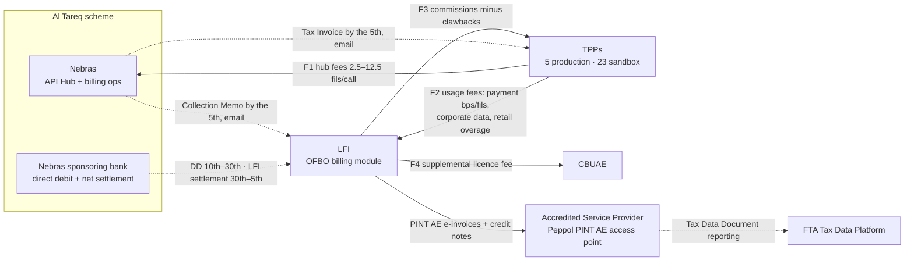
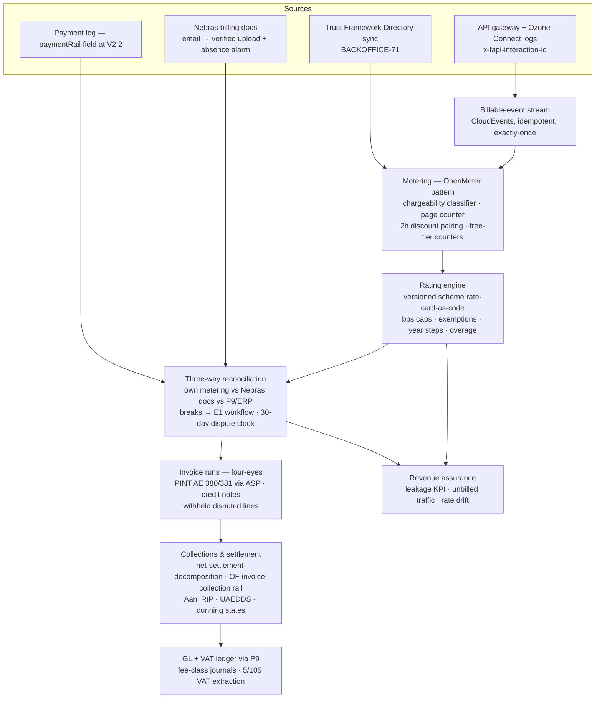

# LFI Billing System — Research & Reference Design
## OFBO E6 Extension · Tier 2 Focus

| Field | Value |
|---|---|
| **Version** | 1.0 |
| **Date** | 4 August 2026 |
| **Status** | Research baseline — feeds the E6 extension of `docs/PRD_Open_Finance_Back_Office.md` (BACKOFFICE-71..80, BD-15/16) |
| **Scope** | The complete billing capability a UAE LFI needs to operate Open Finance as a business — scheme fees in and out, invoicing, collections, settlement, revenue assurance — and its productization as a value-added service, especially for **Tier 2 institutions** |
| **Companions** | `docs/PRD_Open_Finance_Back_Office.md` · `specs/backoffice-openapi.yaml` (tag `tpp-billing`) · `docs/backlog.yaml` (BILLING milestone) |
| **Evidence date** | All external facts verified against sources on 4 Aug 2026; each carries its link in §13 |

> **Repo placement (11 Aug 2026).** This document is the research baseline behind the backlog's **BILLING** milestone: the §10 proposals (BACKOFFICE-81..90) are realized as **BILL-01..10** in `docs/backlog.yaml` — new BACKOFFICE ids stay reserved for a future PRD §7 uplift. §3.5's BD-15 resolution (Interaction Guide v5.0 §10.16) is direct input to `docs/adrs/0007-tpp-of-record-payables-net-settlement.md` and to item C5 of `docs/tier2-baas-execution-plan.md`; the §9 packaging feeds its C4 pricing one-pager. The E6 core this document extends (BACKOFFICE-71/-72/-73/-75) is already done on `main`.

---

## 1. Executive Summary

**The scheme's billing operation has quietly formalized — but the institution-side burden has not moved.** The Nebras Interaction Guide is now at **v5.0 (June 2026)**, superseding the v4 that E6 was derived from. It fixes a monthly calendar (data extracted on the 3rd; Tax Invoices to TPPs and **Collection Memos to LFIs** issued by the 5th; direct debit presented on the 10th; collection through the 30th; LFI settlements transferred 30th–5th) and adds a **§10.16 "LFI Payment Settlement"**: Nebras collects TPP-owed amounts and facilitates onward transfer to LFIs under a documented LFI–TPP Agreement, with net settlement through Nebras's sponsoring bank where the institution also operates as a TPP. Yet distribution is still **email** (billing@nebrasopenfinance.ae), the knowledge base still says "billing won't be via API", Nebras shares only aggregated supporting data, and the LFI remains responsible for verifying every fils, issuing VAT-compliant invoices, and catching disputes inside a **30-day window**. Everything the OFBO seed assumed about the operating gap holds; the mechanics are now better documented — and BD-15 is substantially resolved (§3.5).

**Billing is the LFI's revenue system, not compliance plumbing.** The strongest global lesson (§7) is a natural experiment: jurisdictions that don't pay the data/account provider (India's AA framework, Australia's CDR) got degraded API quality, provider resentment and stalled adoption; jurisdictions now converging on paid access (UK cVRP's centrally-priced MLA, EU FIDA's "reasonable compensation", JPMorgan's aggregator fees) treat provider revenue as the engine of quality. The UAE is ahead of nearly everyone: a **published, regulated rate card** already entitles the LFI to payment fees (38 bps → 25 bps merchant collections, capped AED 50; 25 fils P2P; 250 fils corporate; AED 4 large-value/invoice collection), corporate data fees (40 fils/page) and retail overage pricing the LFI itself sets in the directory. An institution without metering, rating and receivables machinery simply forfeits this entitlement — or books it wrong.

**Volumes are small but compounding fast — which dictates the architecture.** July 2026 production: 186k API calls, 11,739 payments worth AED 64.08m (roughly doubling month-on-month since April), 18 live LFIs, 5 live TPPs. API Hub fee flows are still trivial (order AED 3–4k/month ecosystem-wide), but TPP→LFI payment fees at July's run-rate are already meaningful (illustratively ~AED 240k/month ecosystem-wide if July's volume priced at Year-1 merchant-collection rates) and will inflect again when **30 Tier 2 banks land their entire retail+SME mandate in September 2026**, corporates in the same month, and V2.2 brings FX commissions. The consequence: no individual Tier 2 institution can justify building this — but the work is identical for all of them. Billing is the most naturally **multi-tenant** OFBO capability.

**The latest standards make this a distinctly 2026 build, not a re-run of telco billing.** Four stacks converge: (1) **UAE e-invoicing** — Peppol **PINT AE** under the 5-corner DCTCE model is live in pilot since 1 July 2026; any institution with revenue ≥ AED 50m must appoint an Accredited Service Provider by **30 Oct 2026** and issue e-invoices from **1 Jan 2027**, and fee-based B2B supplies (squarely including OF usage fees to TPPs) are **in scope** — the OF TPP invoice run is the perfect low-volume pilot corpus during the penalty-free voluntary window. (2) **Event-native metering** — CloudEvents-shaped, idempotent, exactly-once usage metering (OpenMeter pattern) which Woven has already standardized on (PRD D-11/D-12: Kong Konnect + OpenMeter). (3) **TM Forum billing semantics** (TMF635 usage / TMF678 customer bill) and telco **interconnect settlement practice** — rate your own records, reconcile three ways, dispute inside contractual windows, net settle — as the correct mental model for scheme-fee billing, with revenue-assurance benchmarks (2–5% leakage unmanaged) as the value narrative. (4) **Collection over the institution's own rails** — the scheme's Large Value/Rent/**Invoice Collection** category (AED 4/tx, for invoices > AED 5,000) plus Aani request-to-pay and UAEDDS pull as fallbacks: the LFI can collect its OF invoices *through* Open Finance.

**Recommendation.** Extend E6 with ten requirements (BACKOFFICE-81..90, §10): scheme rate-card-as-code, an independent billable-event metering feed, a receivables rating engine, PINT AE e-invoicing, collections/dunning with net-settlement decomposition, a commissions-and-clawbacks module, GL/VAT posting, a revenue-assurance KPI loop, TPP profitability analytics, and multi-tenant enablement. Then package the module as a **managed billing service for Tier 2** (30 banks + 28 insurers, §9) — the sharpest wedge OFBO has, because it is the one back-office capability with a monthly cash consequence and a regulatory calendar (Sep-2026, Oct-2026, Jan-2027, Mar-2027) that Tier 2 institutions cannot ignore.

---

## 2. The Money Flows an LFI Must Operate

Open Finance billing at an LFI is five distinct flows, three of which are absent from a TPP-centric reading of the pricing model:

| # | Flow | Direction | Basis | Mechanics today (Aug 2026) |
|---|---|---|---|---|
| F1 | API Hub consumption fees | TPP → Nebras | 2.5 fils/call standard; quotes tiered 5–12.5 fils; 0.5 fils paired balance/CoP; `GET /tpp-reports` chargeable since May 2026 | Nebras Tax Invoice to each TPP by the 5th; DD on the 10th. Touches the LFI only in its **TPP-of-record role** (TPP-aaS), where it is the payer |
| F2 | Usage fees | TPP → LFI | Payment initiation (bps/fils schedule), corporate data 40 fils/page, retail overage above free tiers at the LFI-set directory rate | **The LFI's receivable.** Collection Memo from Nebras by the 5th states amounts; cash arrives via scheme net settlement (IG v5.0 §10.16) and/or the LFI invoices TPPs directly (self-invoicing arrangements permitted). Tax invoice issuance is the LFI's obligation either way |
| F3 | Commissions | LFI → TPP | Insurance commissions (5–15% by line, 30-day cool-off, clawback 5 yrs life / 2 yrs others); FX 0.07% and remittance 0.1% (min 50 fils) once V2.2 activates FX | TPPs invoice LFIs (insurance Billing & Collection SOP, Mar 2026); Nebras collection facilitation is optional and carries a Nebras service fee; bilateral rates override defaults and must be lodged at production onboarding |
| F4 | Regulatory fees | LFI → CBUAE (and TPP → CBUAE) | Supplemental licence fee (charged and collected by CBUAE); TPP licence fees AED 20k/100k per year above 50k/100k active connections (deemed licensees exempt) | Direct CBUAE billing; the historic page detail (5-yr averages: Tier 1 bank AED 1,064,000; **Tier 2 bank AED 252,000**; Tier 1 insurer 60,000; Tier 2 insurer 30,000) was removed from the public page in Nov 2025 — treat as indicative only |
| F5 | Scheme compensation & adjustments | bidirectional | Limitation of Liability Model v2.1 amounts (AED 200–10,000 per incident class; Sanadak escalation); billing-dispute outcomes; insurance clawbacks | Enter the billing system as credit notes, withheld lines and negative accruals — not as an out-of-band process |

The dual-role premise of the OFBO PRD applies with force here: the same institution is simultaneously a **payer** (F1 as TPP-of-record, F3, F4) and a **payee** (F2, plus F1 pass-through re-billing to TPP-aaS fintechs with margin, BACKOFFICE-07). §10.16's netting clause ("netting where the LFI also operates as a TPP") makes the two sides meet in one settlement figure — which only a system that models both sides can decompose and verify.

---

## 3. The Scheme Billing Model as of August 2026

### 3.1 Instruments and versions

| Instrument | Version / date | What it governs | Change signal |
|---|---|---|---|
| CBUAE **Commercial & Pricing Model** | "Version 1.0" (4 Oct 2024) — but Confluence page **v31, last edited 2 Jun 2026** | The entire rate card, chargeability, collection principles | The page **evolves without version bumps** (Nov 2025 restructure; 10 Jan 2026 clawback extension; 13 May 2026 chargeable-endpoint enumeration; 2 Jun 2026 Merchant-ID condition). A billing system must watch the page, not the version label |
| **Nebras Interaction Guide** | **v5.0, June 2026** (74 pp; supersedes v4 Mar 2025 that E6 cited) | Billing calendar (§10), payment methods, dispute SLAs, LFI settlement (§10.16) | BD-16 refresh required — v5.0 figures in §3.2 below |
| Insurance **Billing & Collection SOP** | March 2026 deck | Brokerage/commission collection, DDA setup, clawback adjudication | New since the PRD; loads F3 |
| "Operational Readiness: Billing and Invoicing" session | 14 Jul 2026 | Walkthrough of the above (recordings only) | Confirms operational go-live emphasis mid-2026 |
| Standards **V2.2** | **Not published** as of 4 Aug 2026 ("to be published shortly" since Jan 2026) | Adds `paymentRail` (AANI/FTS/LFI) mandatory on terminal payment-log entries — a settlement-reconciliation gift — plus data-deletion attestations, payment-log pagination; carries FX (activating F3 FX commissions) | Uplift deadlines: Tier 1 release 31 Dec 2026 / go-live 31 Mar 2027; **Tier 2 28 Feb 2027 / 31 May 2027** |
| CAAP pricing | Placeholder | Future LFI cost line | Still "not yet published" — a coming payable with no rate card yet |

### 3.2 The monthly cycle (IG v5.0 §10) — the calendar the billing module must run against

| Day | Event | LFI-side implication |
|---|---|---|
| 3rd | Nebras extracts the month's data from the API Hub | LFI's own metering cut-off should mirror this boundary exactly |
| ≤ 5th | **Tax Invoice** (to each TPP, for hub fees) and **Collection Memo** (to each LFI — the amounts Nebras is collecting/settling on its behalf under the LFI–TPP Agreement) issued **by email** to Primary Business Contacts; participant must raise a ticket if not received by the 5th | Verified-upload ingest (BACKOFFICE-73 step 1) with an *absence alarm* — a missing memo is itself an incident |
| 10th | Direct Debit Authority presented to Nebras's sponsoring bank (DD is the **required primary payment method** for TPP invoices; "additional payment options under review") | For the TPP-of-record role: fund the DD account; for the LFI role: expect TPP-side collection to begin |
| 10th–30th | Collection window | Dunning/exposure tracking on the receivables side |
| 30th – 5th (next month) | **LFI fee and commission settlements transferred** (net settlement via sponsoring bank; netting across the institution's LFI and TPP roles per the LFI–TPP Agreement) | Settlement decomposition: memo lines → net figure → cash; unexplained residue = break |
| Any time, ≤ 30 days of occurrence | Billing queries must be raised (first response 10 min; final response 10 days; escalation review 15 days; escalations@nebrasopenfinance.ae; onward to Sanadak for eligible complainants) | The reconcile-before-invoice pipeline must complete fast enough to raise disputes **inside the window** — reconciliation latency is a compliance parameter, not a convenience |
| On breach | Late payment ⇒ penalty fees on invoice, reminders, possible service suspension | Payables hygiene protects the institution's own service continuity |

Two operational facts survive from the current-state evidence and must anchor the design: **there is no billing API or portal** (KB: "Billing won't be via API"; a matching portal was promised but has not appeared), and **Nebras shares only aggregated supporting data** — participants pull raw data from the API Hub themselves. Independent metering is therefore not optional: it is the only source of line-level evidence for a dispute.

### 3.3 The rate card the rating engine must implement

**API Hub fees (F1 — the institution pays these in its TPP-of-record role):** 76 TPP-facing endpoints classified 50 chargeable / 26 free. Payment initiation, data-sharing page, insurance data, standalone balance and CoP: **2.5 fils**; balance and CoP **0.5 fils** when paired with a payment within 2 hours (one balance + one CoP discount per payment); quote creation tiered **5 / 7.5 / 10 / 12.5 fils** by number of quoting LFIs (≤4 / ≤10 / ≤25 / >25); quote retrieval, payment status, consent management, discovery: free; **`GET /tpp-reports` chargeable since 13 May 2026** — polling the reporting API now costs money, a detail metering must know.

**TPP→LFI usage fees (F2 — the institution's receivable):**

| Category | Rate | Rating rules that bite |
|---|---|---|
| Merchant collections | Year 1 **38 bps** → Y2 35 → Y3 32 → Y4 29 → Y5 **25 bps**, cap **AED 50/tx** | First **AED 200/day per merchant free — only if Merchant ID is populated** in the request (condition added 2 Jun 2026); "Year 1" anchor (start of Nebras operations) **publicly undefined** — a live configuration risk |
| P2P / SME-to-SME | **25 fils**/tx | flat |
| Me-to-me | 20 → 18 → **17 fils** (Y1–Y3) | flat, stepped |
| SME bulk/batch | **25 fils**/tx, cap **250 fils per batch** | no limit on tx per batch — cap logic per batch, not per tx |
| Large Value / Rent / **Invoice Collection** | **AED 4**/tx | applies to embedded-payment-link collections > AED 5,000 — the category the LFI can itself use to collect its TPP invoices (§6.2) |
| Corporate payments (incl. bulk) | **250 fils**/tx | Corporate = turnover > AED 100m/yr |
| Corporate data sharing | **40 fils per page** (100 lines) | CoP free |
| Retail data sharing | Free ≤ **15 attended / 5 unattended pages per customer per day**; above that, the **LFI's own published rate** | The overage rate lives machine-readably in the directory (`ApiMetadata.OverLimitFees`). Today only two LFIs publish one (AED 50.00 and AED 9.50 per page); every silent LFI is giving overage away free — a pricing decision most institutions don't know they've defaulted |

**LFI→TPP commissions (F3):** insurance — Motor 5%, Travel/Home/Renters 15%, Life 10% (capped), Health 5% (sub-AED 4,000/month earners), ILoE 0%; payable only 30 days post-sale (cool-off), **clawback window 5 years for life / 2 years for others** (extended 10 Jan 2026); bilateral agreements override defaults and pre-date-Nov-2025 broker agreements persist 2 years past the March 2026 Open Insurance launch. FX (on V2.2 activation): FX 0.07%, remittance 0.1%, min 50 fils. Quote-validity tolerances gate commission eligibility: executed premium within **±17.5%** of quote; FX executed rate within **50 pips**.

**Cross-cutting rules:** fees apply to **technically successful calls only** (the billable-event definition — distinct from business success); all TPP↔LFI fees are **inclusive of VAT** (the tax amount is extracted 5/105, §6.1); invoicing and VAT are handled by the **receiving party**, not Nebras; end-user caps (63→50 bps merchant, 50 fils P2P, AED 10 large-value, 450 fils corporate) constrain TPP pricing but are out of the LFI billing system's scope; LFIs cannot surcharge OF-initiated payments; the model is **reviewed annually by CBUAE with the Nebras board** — rate-card change is a certainty, only timing is unknown.

### 3.4 What remains manual, ambiguous or missing — the gap the module fills

1. **Email-only distribution** of invoices and memos; bounce handling is the participant's problem. 2. **No billing API**; the promised matching portal has not shipped. 3. **Aggregated supporting data only** — line-level evidence is the participant's own job. 4. **Year-step anchor undefined** publicly for every multi-year schedule. 5. **CAAP pricing unpublished** — an uncosted future payable. 6. **V2.2 unpublished** with FX commissions waiting on it. 7. The **C&P page mutates without version bumps** — four substantive edits in seven months. 8. **Net-settlement operational detail** (file formats, decomposition reports, timing tolerances) not publicly documented. Every one of these is a requirement in §10.

### 3.5 BD-15 resolved, BD-16 refreshed

**BD-15 (collection model).** The June 2026 evidence closes most of the question: **both models co-exist by design.** IG v5.0 §10.16 establishes Nebras-facilitated collection and net settlement to LFIs under a documented **LFI–TPP Agreement**, while the C&P model continues to permit **self-invoicing arrangements** and puts invoicing/VAT on the receiving party — and the operational reality observed at a Tier 1 institution (Jun 2026: emailed billing records, LFI issues invoices to each TPP) remains consistent with that. Design consequence: **build the receivables pipeline invoice-first** (the tax-invoice obligation exists regardless of who moves the cash), and treat scheme net settlement as a *collection channel* whose remittances must be decomposed against issued invoices — per counterparty, per the LFI–TPP Agreement in force. BACKOFFICE-73's shape survives; its step 5 gains a settlement-decomposition sub-step (BACKOFFICE-85).

**BD-16 (Interaction Guide figures).** Re-baseline all E6 clocks to v5.0: billing-query window 30 days of occurrence; first response 10 min; final response 10 days; escalation review 15 days; monthly calendar 3rd/5th/10th/30th/30th–5th; DD as required primary payment method; late-payment penalty and suspension exposure. (Respondent-side dispute clocks in BACKOFFICE-75 should be re-verified against v5.0's dispute chapter at build time.)

---

## 4. Derived Requirements — Scheme Rule → System Capability

| Scheme rule (source §3) | Capability required | OFBO today | Gap |
|---|---|---|---|
| Success-only chargeability, 50/26 endpoint split, paired 2h discounts, page = 100 lines, attended/unattended free tiers per customer per day | **Metering** with chargeability classification, discount-window pairing, rolling per-customer counters | E1 matches against Nebras records; no independent billable-event stream | **BACKOFFICE-82** |
| bps-with-cap-and-conditional-exemption, batch caps, year-stepped schedules with undefined anchor, LFI-set overage, VAT-inclusive amounts | **Rating engine** on a versioned, effective-dated rate card | Fee schedule hard-referenced in BACKOFFICE-01 acceptance | **BACKOFFICE-81, -83** |
| Page mutates without version bumps; annual CBUAE review | **Rate-card watch** + change audit | Nothing | **BACKOFFICE-81** |
| Collection Memo/Tax Invoice by email by the 5th; absence = participant's problem | Verified ingest **with absence alarm** | BACKOFFICE-73 step 1 (ingest only) | extend |
| 30-day dispute window; 10-day final response | Reconciliation **latency SLO** sized to the window; one-click Nebras query | E1 break workflow + BACKOFFICE-05 | timing SLO |
| Invoicing/VAT by receiving party; e-invoicing mandate Phase 1 | **PINT AE invoice/credit-note issuance** via ASP; TDD reporting | P9 renders PDF invoices | **BACKOFFICE-84** |
| DD primary; net settlement 30th–5th; netting across roles | **Settlement decomposition** + collections/dunning | BACKOFFICE-73 step 5 mentions net-settlement effects | **BACKOFFICE-85, -87** |
| Commission cool-offs, clawbacks 5y/2y, bilateral overrides, quote tolerances | **Commissions payable sub-ledger** with negative accruals | Not modeled | **BACKOFFICE-86** |
| Aggregated data only; no billing API | **Independent evidence store** (line-level, immutable, trace-linked) | `x-fapi-interaction-id` propagation exists platform-wide | **BACKOFFICE-82** |
| Unbilled traffic, silent overage give-away, leakage | **Revenue-assurance loop** with KPI | BACKOFFICE-72 unbilled-traffic alert (registration-gap only) | **BACKOFFICE-88** |
| Annual fee review; pricing decisions (overage rate, TPP-aaS margin) | **Profitability analytics + fee simulation** | BACKOFFICE-07 margin, BACKOFFICE-31 finance view | **BACKOFFICE-89** |
| One build, many institutions (Tier 2) | **Multi-tenant billing service** | `bank_id` schema tenancy, RLS, ports model | **BACKOFFICE-90** |

---

## 5. Reference Architecture — the OFBO Billing Module

### 5.1 Design principles

1. **Meter independently — the interconnect posture.** Treat Nebras exactly as telcos treat an interconnect partner: rate your own records against the shared rate card, exchange statements, reconcile three ways, dispute inside the contractual window, settle net. Never let the counterparty's statement be the only ledger. (Telco revenue-assurance benchmarks put unmanaged leakage at 2–5% of revenue — that is the do-nothing baseline.)
2. **Facts separate from money.** The metering layer records immutable billable *events*; the rating layer turns events into *amounts* under a versioned rate card. Re-rating (after a rate-card correction or dispute outcome) replays facts through new prices — it never rewrites facts. This is the consensus pattern across OpenMeter, Metronome, Orb and Stripe's Meter Events API.
3. **Rate-card-as-code.** The scheme rate card is small (dozens of lines) but subtle (caps, exemptions with conditions, pairing windows, year steps with an undefined anchor, per-LFI overage). It belongs in version-controlled, effective-dated configuration with a diff-audit trail — the same discipline the platform applies to API contracts — plus a watcher on the upstream page precisely because upstream mutates without version bumps.
4. **Reconcile before invoice** (already binding, BACKOFFICE-73): only reconciled-clean or resolved lines reach an invoice; disputed lines are withheld and carried or credit-noted.
5. **E-invoice-native.** From the first build, the invoice artifact is a PINT AE UBL document (plus a rendered PDF for humans), because the mandate makes anything else a rework by January 2027.
6. **Collect over your own rails where possible** (§6.2), with scheme net settlement decomposed rather than assumed.
7. **Multi-tenant by construction.** `bank_id` tenancy, RLS and the ports model already exist in OFBO; billing adds per-tenant rate-card overlays, invoice templates and ASP routing — nothing structural.

### 5.2 Pipeline

**Ingest & meter.** The institution's gateway and Ozone Connect logs already carry everything needed to derive billable events (endpoint, outcome, consent, TPP, `x-fapi-interaction-id`, line counts). Emit them as CloudEvents with client-generated idempotency keys into a metering store with exactly-once semantics — the OpenMeter architecture (Kafka → dedup → ClickHouse) is the reference, and is doubly attractive here because **Woven has already standardized on Kong Konnect + OpenMeter as its tenant control plane and metering layer (PRD D-11/D-12)**: the billing module extends an existing platform decision instead of introducing a stack. Meters that must exist beyond simple counts: page aggregation (100-line units, 13-month span rule), attended/unattended classification, per-customer-per-day free-tier consumption, payment↔balance/CoP pairing within the 2-hour window (one of each per payment), Merchant-ID presence on merchant collections, and quote-tier fan-out (number of quoting LFIs).

**Rate.** A deliberately small rating service over metered aggregates: price plans keyed by (fee class, segment, effective date, tenant), supporting flat fils, percentage-with-cap (bps, AED 50), batch caps, conditional exemptions (AED 200/day/merchant, Merchant ID required), stepped multi-year schedules with a **configurable anchor date** (because the scheme hasn't defined one), per-LFI directory-published overage, and negative events (clawbacks, compensation credits). Buy-vs-build: at this rate-card size a bespoke rating service on OpenMeter aggregates is proportionate; Kill Bill (mature OSS: versioned catalogs, credit notes, overdue state machines, multi-tenancy) and Lago (percentage rates, dunning) are the fallback if AR complexity grows — either way, keep TMF635 (usage) / TMF678 (customer bill) semantics as the API shape so the module speaks a standard dialect to ERP and analytics consumers.

**Reconcile.** Three-way, per TPP, per fee class: own rated metering ↔ Nebras Collection Memo / Tax Invoice / billing records ↔ P9/ERP postings (and, on the TPP-of-record side, downstream fintech re-billing per BACKOFFICE-07). Every break carries the three source refs and the linked FAPI trace (BACKOFFICE-11 pattern). New clock: breaks that implicate Nebras figures must convert to a formal billing query **inside 30 days of occurrence** — the pipeline SLO is therefore "memo ingested by the 5th, reconciled by ~the 12th", leaving a comfortable dispute margin. At V2.2, `paymentRail` (AANI/FTS/LFI) on payment-log entries strengthens settlement-side matching for free.

**Invoice.** Monthly invoice run per counterparty TPP (four-eyes, 409-if-unreconciled — already contracted in `specs/backoffice-openapi.yaml`): VAT-inclusive scheme amounts → 5% VAT extracted (5/105) → PINT AE Billing invoice (doc type 380) or credit note (381) through the ASP, TDD reported to FTA automatically by the ASP under the 5-corner model; foreign TPPs (no UAE establishment) flagged as zero-rated exports with the export transaction-type flag, still e-invoiced and TDD-reported. Buyer identification via TIN (Peppol endpoint scheme 0235). Withheld lines and clawbacks ride as explicit invoice lines or credit notes the following cycle.

**Collect & settle.** Two channels, decomposed rather than conflated: (a) **scheme net settlement** — remittances arriving 30th–5th via the sponsoring bank are matched invoice-by-invoice, netting across the institution's LFI and TPP roles explained line-by-line, residue = break; (b) **direct collection** where the LFI–TPP Agreement runs that way — present the invoice with an OF **Large Value/Invoice Collection** payment request (AED 4 capped) for amounts > AED 5,000, Aani request-to-pay below the AED 50,000 rail limit, UAEDDS mandate as the recurring pull fallback. Dunning states (current → reminded → overdue → escalated → suspended-service-risk) mirror the scheme's own late-payment ladder.

**Assure & account.** A monthly revenue-assurance report: metering coverage (% of gateway traffic classified), variance vs Nebras, unbilled-traffic (TPP active with no invoice line and no P9 registration — extends BACKOFFICE-72), silent-overage give-away (retail pages above free tier billed at zero because no directory rate is published), leakage KPI with a **< 1% target** against the 2–5% unmanaged benchmark. GL posting via P9 by fee class (payment fees, data fees, overage, commissions payable, clawback recoveries, hub fees payable, Nebras service fees), with the VAT ledger fed from the invoice run.

### 5.3 The monthly run against the scheme calendar

| Day | Module action |
|---|---|
| 1st–3rd | Close own metering for the prior month at the Hub's extraction boundary; draft rated statement per TPP available internally (the "expected memo") |
| 5th | Ingest Collection Memo + (TPP-role) Tax Invoice; absence alarm if missing; auto-diff against expected statement |
| ~5th–12th | Three-way reconciliation; breaks worked through E1; Nebras billing queries filed for confirmed variances (well inside the 30-day window) |
| ~12th–15th | Four-eyes invoice run per TPP from reconciled-clean lines; PINT AE issuance via ASP; payment requests attached (OF rail / RtP) |
| 10th–30th | TPP-role: fund DD for the Nebras invoice; LFI-role: watch collections, dunning on direct-collection counterparties |
| 30th–5th | Match net-settlement remittances; decompose netting; post to GL; close the VAT position |
| Month-close | RA report + Finance sign-off (extends BACKOFFICE-06 to cover payables, receivables, commissions and settlement decomposition) |

---

## 6. Latest Standards Leveraged

### 6.1 UAE e-invoicing — PINT AE under the DCTCE 5-corner model

The UAE E-Invoicing Programme is the single most consequential "latest standard" for this system, because it converts the LFI's TPP invoice run from a PDF-by-email habit into a regulated document flow:

- **Model:** Decentralised CTC and Exchange (DCTCE) "5-corner" Peppol: supplier → supplier's **Accredited Service Provider** → buyer's ASP → buyer, with the FTA's central **Tax Data Platform** as the fifth corner receiving near-real-time **Tax Data Documents** from both ASPs. Both parties must appoint an ASP; ~**41 ASPs** were accredited/pre-approved as of Jul 2026 (verify the current MoF list before selection).
- **Format:** **PINT AE v1.0.3** (26 Mar 2026), UBL 2.1-based, with dedicated **Billing** and **Self-Billing** BIS. Document types: 380 tax invoice, 381 tax credit note, out-of-scope variants, self-billing types. UAE particulars: buyer/seller identified by 10-digit TIN (Peppol endpoint scheme **0235**), all tax amounts in **AED**, tax categories S (5%) / E / Z / O / AE, mandatory transaction-type flags (exports, summary invoice, continuous supply, disclosed agent billing — the last one relevant if Nebras-facilitated collection is ever papered as agency).
- **Timeline & scope:** pilot **live since 1 Jul 2026** (voluntary adoption penalty-free); Phase 1 (revenue ≥ AED 50m — every bank and most insurers): **appoint ASP by 30 Oct 2026, issue/receive/report from 1 Jan 2027**; Phase 2 (< AED 50m) 1 Jul 2027; government 1 Oct 2027. Penalties from Cabinet Decision 106/2025 (AED 5,000/month for failure to implement; per-document fines). B2B and B2G in scope; B2C excluded for now.
- **Financial-services nuance (decisive):** MD 243/2025 excludes **exempt** Art-42 financial services from e-invoicing scope — but **fee-based, standard-rated supplies are in scope**, and OF usage fees to TPPs are exactly that (explicit fees ⇒ 5% VAT; the scheme's "VAT-inclusive" amounts mean the tax is extracted at 5/105). Foreign TPPs: zero-rated export of services (conditions per Art 31 as amended), still e-invoiced and TDD-reported; inbound invoices from foreign suppliers are out of scope.
- **The pilot opportunity:** the OF TPP invoice run is a **near-perfect e-invoicing pilot corpus** during the voluntary window — low volume (single-digit counterparties today), purely B2B, clean fee lines, no legacy migration. An institution can prove its ASP integration on OF billing in Q4 2026 and walk into the 1 Jan 2027 mandate already live — inverting the usual compliance-project sequencing, and giving the OF team an institution-level win.

### 6.2 Collection rails — collect through the scheme you operate

The scheme's own **Large Value / Rent / Invoice Collection** category (AED 4/tx capped, for embedded-payment-link collections > AED 5,000) is purpose-built for exactly this: a PINT AE invoice paired with an OF pay-by-bank request, settling instantly over Aani rails at a fee an order of magnitude below merchant-collection bps. Below AED 50,000, **Aani request-to-pay** (12.5m users, 750k merchants, 74 FIs live; MoF itself now accepts Aani for federal fees) is the lightweight alternative; **UAEDDS** mandates remain the boring, reliable pull for fixed monthly amounts; and on the payable side Nebras requires **direct debit** anyway. An LFI collecting its OF receivables over OF rails is both good engineering and a credible public proof-point for the scheme.

### 6.3 Metering and event standards

**CloudEvents** as the billable-event envelope, **OpenTelemetry** as the collection substrate — with `x-fapi-interaction-id` already propagated end-to-end in OFBO, every invoice line remains traceable to a FAPI transaction trace (BACKOFFICE-11/-13 extend naturally to billing evidence). Idempotent ingestion (client event ID + dedup window + exactly-once sink) is what makes re-rating and replay safe. This is the same event discipline the Woven platform already runs for enrichment cost metering (D-12), applied to scheme billing.

### 6.4 Billing-domain semantics

**TM Forum Open APIs** — TMF635 (usage management: usage records with rating status) and TMF678 (customer bill management: bills, applied billing rates, bill runs) — provide a vendor-neutral shape for the module's own API surface, keeping it legible to ERP integrators and any future BSS tooling. The existing `tpp-billing` tag in `backoffice-openapi.yaml` (counterparties, billing-records, invoice-runs) maps cleanly onto these semantics without renaming.

### 6.5 Forward compatibility — per-call, real-time and agentic

The monthly-invoice world is not the end state. The x402 revival of HTTP 402 (Coinbase/Cloudflare; v1.0 targeted Q3 2026) prototypes **per-call, pre-authorized machine payments** for API and agent traffic, and the scheme itself will eventually face premium/value-added API pricing beyond the mandate (the annual CBUAE review is the vehicle; the UK's evolution from mandate → centrally-priced commercial scheme is the pattern). Design consequence, cheap to honor now: keep metering real-time and event-native so a **real-time debit rail can be added without re-instrumentation** — the entitlements/credit machinery in OpenMeter (already used for Woven cost circuit-breakers) is precisely that rail.

---

## 7. Global Precedents — What They Teach

| Jurisdiction / scheme | Model | Outcome | Lesson for the LFI billing build |
|---|---|---|---|
| **India — Account Aggregator (Sahamati)** | FIU pays AA per fetch, bilaterally negotiated (published example: 1 paisa–₹25/fetch); **no FIP (data-provider) compensation at all**; no central clearing utility (SahamatiNet MVP = router/registry/IAM/observability only); disputes via empanelled ODR | Massive scale (FY25: 115.8m consents, 179 FIPs, 748 FIUs) but chronic FIP under-investment — downtime and data-fidelity complaints; an FIP-compensation framework has been "in development" for years | A scheme leg with no revenue decays. The UAE *pays* LFIs — so build the receivables machine properly and capture it. Bilateral pricing at ecosystem scale doesn't work; the UAE's central rate card is an asset. Time-bound, contract-embedded dispute paths (ODR-style) beat ad-hoc escalation |
| **UK — OBL / cVRP (UKPI)** | OBIE/OBL levy-funded by CMA9 for 8 years; commercial VRP finally launched via a **Multilateral Agreement with a central price** (~6–8p/tx of which ~3.5p operator scheme fee), operated by UKPI (31 funding firms); first live Nov 2025, Wave 1 full go-live 2 Jun 2026; Wave 2 e-commerce moves to ad valorem | Levy-funded infrastructure stalled investment for years; central pricing killed bilateral negotiation overhead and got cVRP live; regulators declined to challenge the central price | Central multilateral pricing works and is defensible; expect the UAE's flat-fee schedule to evolve toward ad valorem as commerce use cases grow; fund scheme operations per-transaction, not by levy. Rate cards change — version the rate card, not the code |
| **Australia — CDR** | Data holders **prohibited from charging** accredited recipients for mandated data | ~A$1.5bn compliance spend, minimal uptake, a government "reset"; no provider charging right as of Aug 2026 | The zero-compensation counterfactual: cost with no revenue produces resentment and minimal quality investment. The strongest argument for treating UAE LFI billing as a first-class revenue system |
| **Brazil — Open Finance** | Independent governance association funded by **mandatory participant contributions** (vote weight ∝ contribution, capped); no per-call inter-participant fees | Funds shared infrastructure well; no provider revenue leg | Participant-contribution funding suits *infrastructure*, not provider economics — a different problem than the LFI's |
| **Saudi / Bahrain** | No published inter-participant fee models; commercials bilateral/unpublished | — | The UAE is regionally first with a public scheme rate card — an exportable head start for anyone who industrializes billing against it |
| **EU — FIDA (PSD3 era)** | Data holders may charge users **"reasonable compensation"** agreed within Financial Data Sharing Schemes; adoption expected 2026, access waves 2027–2029 | Direction of travel: compensated access, scheme-governed rates | Europe is converging on the UAE's model. Billing capability built here is forward-compatible with the largest coming market |
| **US — market-led** | JPMorgan began charging data aggregators per API access (2025–26) amid CFPB 1033 turmoil | Unilateral provider pricing, contested but real | Even without a scheme, providers are asserting the revenue leg. Metering-and-billing capability is the prerequisite to any pricing posture |

---

## 8. Value-Added Services for the LFI — the Product Layer

The billing module is not compliance plumbing with a UI; it is the substrate for a laddered VAS catalogue. Each tier is independently sellable and each consumes the one below:

| Tier | Service | What the LFI gets | Substrate |
|---|---|---|---|
| **V1** | **Scheme billing operations** | The §5 pipeline run as a service: ingest + absence alarms, reconcile-before-invoice, four-eyes invoice runs, dispute filing inside the 30-day window, month-close sign-off pack | BACKOFFICE-71..73, -81..85, -87 |
| **V2** | **Revenue assurance** | Independent metering vs Nebras figures; leakage KPI < 1%; unbilled-traffic and silent-overage detection; variance-to-dispute automation; recovered-revenue reporting (the self-funding argument: telco benchmark says 2–5% leaks unmanaged) | BACKOFFICE-82, -88 |
| **V3** | **E-invoicing compliance pack** | PINT AE issuance + TDD via ASP for OF invoices in the voluntary window — then the institution-wide Phase-1 on-ramp (ASP contracted by 30 Oct 2026, live 1 Jan 2027); zero-rated export handling for foreign TPPs | BACKOFFICE-84, BD-17 |
| **V4** | **Commission & clawback management** | Insurance commissions with 30-day cool-off holds, 5y/2y clawback ledger, bilateral-rate registry vs scheme defaults, quote-tolerance gating; FX commissions armed for V2.2 | BACKOFFICE-86 |
| **V5** | **TPP profitability & pricing intelligence** | Per-TPP, per-product-family P&L (receivables − hub costs − liability provisions); year-step and rate-review simulation; the **directory overage-rate decision** surfaced explicitly (publish a rate or knowingly give overage away); TPP-aaS margin (BACKOFFICE-07) folded in | BACKOFFICE-89 |
| **V6** | **Collections & working capital** | Net-settlement decomposition, dunning ladder, OF-rail/RtP/UAEDDS collection orchestration, DSO tracking | BACKOFFICE-85 |
| **V7** | **Benchmarking & regulator-ready reporting** | Anonymized cross-tenant benchmarks (volumes, fee yield, break rates — under the same preventative aggregation governance as `bank_internal_view` + `query_purpose_registry`); CBUAE annual fee-review submission pack | BACKOFFICE-33 pattern, -89 |
| **V8** | **Monetization readiness** | Premium/value-added API pricing beyond the mandate when the scheme opens it; real-time per-call debit rail (x402-pattern) on the same meters; agentic-traffic pricing | §6.5, BACKOFFICE-90 |

The sequencing logic: V1–V2 are bought on fear (deadlines, leakage, audit); V3 is bought on a statutory date; V4 is bought by every Open-Insurance LFI the moment commissions flow; V5–V8 are bought on ambition. All eight run on one pipeline.

---

## 9. Tier 2 Focus — the Market and the Offering

### 9.1 Who Tier 2 is, and what lands on them when

Per the authoritative CBUAE "Annexure 1: Timelines for Market Adoption of Open Finance" (updated Jan 2026):

- **Open Banking Tier 2 = 30 banks** — a deliberately heterogeneous set: local mid-tier (RAKBANK, Sharjah Islamic, Ajman Bank, CBI, United Arab Bank, Bank of Sharjah, Al Masraf, Invest Bank, NBQ, NBF*), digital-native (**Wio**, Zand, Al Maryah Community Bank), group-affiliated (Emirates Islamic, **Al Hilal**), and **15 foreign branches** (Citi, Standard Chartered, BNP Paribas, Barclays, NBK, Bank of Baroda, Banque Misr, Arab Bank, HBZ, ABK, AAIB, UBL, SNB, Agricultural Bank of China, Banorient). (*NBF already shows in production logs.)
- **Open Insurance Tier 2 = 28 insurers** (takaful operators prominent among them).
- **The calendar cliff:** essentially the **entire retail + SME Open Banking mandate — R1, R2, international, SME suite, bulk, extended data, and the v2.1 uplift — lands on all 30 Tier 2 banks on one date: September 2026** (next month), the same month the Corporate mandate lands on both tiers. V2.2 uplift follows (Tier 2 release 28 Feb 2027 / go-live 31 May 2027 per the official roadmap). Insurance Tier 2 data + quotes: **March 2027**.
- Tier 2 is not uniformly behind: Wio is one of the highest-volume LFIs in production **a year ahead of its own deadline** — but it is the exception that proves the rule; most of the other 29 are standing up everything at once.

### 9.2 Why Tier 2 cannot economically self-build billing

What Tier 1 institutions absorbed over 18 months of phased go-lives arrives at Tier 2 as a single event — and the billing workload starts with the **first production billing cycle in October 2026**. The unit economics are hostile to 30 parallel builds:

1. **Fee income starts small** (§1 volumes) while the operating obligation is immediate and monthly: verify the Collection Memo, issue VAT-correct invoices to each consuming TPP, catch variances inside 30 days, fund the DD, decompose net settlement. That is a finance-operations function no Tier 2 institution has hired for.
2. **The fixed costs don't scale down.** The supplemental licence fee alone (historic published 5-yr averages: Tier 2 bank ~AED 252k, Tier 2 insurer ~AED 30k) plus Ozone Connect build, certification, CX and pen-testing are already sunk; a billing build with metering, rating, e-invoicing and settlement decomposition is another multi-month engineering effort for revenue that may be **hundreds of dirhams a month at first**. The rational Tier 2 response is a spreadsheet — which is precisely how leakage, VAT errors and missed dispute windows happen.
3. **Group constraints.** The ~14 foreign-branch banks run group ERPs and group tax processes; a local scheme-billing build competes for head-office change windows. An adapter-based service (P9 port per institution) fits how they actually integrate.
4. **The e-invoicing clock binds them anyway.** Phase 1 (revenue ≥ AED 50m) is tier-blind: most Tier 2 banks must contract an ASP by **30 Oct 2026** and e-invoice from **1 Jan 2027** — within weeks of their OF go-live. Their OF TPP invoices will be *born* into the mandate.
5. **Insurance Tier 2 is the sleeper.** 28 insurers hit Open Insurance in March 2027 with the scheme's most intricate billing: commissions by line with cool-off holds, 5-year life clawbacks, bilateral-rate registries, quote-tolerance gating, optional Nebras collection with service fees. Nobody is building for them.

### 9.3 The offering — OFBO billing as a managed multi-tenant service

The OFBO seed was built for exactly this productization: `bank_id` schema tenancy with RLS, the ports model (each institution supplies only adapters — P9 ERP, P6 egress, P2 IdP), simulator-first delivery, and a Nebras simulator that already injects billing-record faults for demonstrable reconciliation. The billing module completes the story:

| Package | Contents (maps to §8) | Target buyer |
|---|---|---|
| **Starter — "Run the cycle"** | V1: ingest + absence alarms, reconcile-before-invoice, invoice runs (PDF + PINT AE), dispute filing, month-close pack | Every Tier 2 bank from Oct 2026 |
| **Growth — "Capture the revenue"** | + V2 revenue assurance, V6 collections orchestration, V3 e-invoicing pack (ASP integration, TDD, zero-rated exports) | Tier 2 banks with real TPP traffic; any institution facing the Jan 2027 mandate |
| **Scale — "Operate the business"** | + V4 commissions/clawbacks (insurance, FX at V2.2), V5 profitability & pricing intelligence, V7 benchmarking, V8 monetization readiness | Insurance LFIs from Mar 2027; ambitious digital-natives; Tier 1 institutions wanting the analytics layer |

**Deployment models:** (a) shared multi-tenant SaaS (fastest, cheapest — RLS + per-tenant rate-card overlays and invoice templates); (b) dedicated single-tenant instance (foreign branches with group data constraints); (c) licensed on-prem port (the M6 enterprise-adoption path, per institution). All three run the same contract tests.

**Commercial sketch (order-of-magnitude, to be priced properly):** the buy-side anchor is headcount avoided — the cycle in §5.3 is realistically 0.5–1.5 finance-ops FTE plus an engineering build none of them want. A Starter subscription in the **AED 8–15k/month** band per institution undercuts a fraction of one FTE; Growth at **AED 15–30k** with an optional success fee on recovered leakage (the RA report funds itself); Scale bespoke. Full-adoption ceiling across 58 Tier 2 institutions at blended ~AED 15k/month ≈ **AED 10m ARR** — modest as a standalone business, decisive as a **wedge**: billing is the one OFBO surface with a monthly cash consequence, and the institution that adopts the billing module has adopted the OFBO substrate (identity, audit, reconciliation, ports) for everything else.

**Precedent for the play:** Engine by Starling productized one institution's internal stack into SaaS for other regulated institutions; Ozone API sells scheme compliance-as-a-service globally (and already powers the API Hub itself). **No one in the UAE offers scheme-billing-as-a-service today** — confirmed whitespace as of Aug 2026.

**Regulatory posture to engineer in from day one:** operating billing for another LFI is likely **material outsourcing** under CBUAE outsourcing expectations — data residency per tenant (region-parameterised IaC already in OFBO), per-tenant auditability (INSERT-only audit, lineage), exit/portability provisions, and absolute cross-tenant confidentiality of billing data (benchmark aggregation only under the `query_purpose_registry` preventative-control pattern). PDPL exposure is limited — billing objects are TPP-level, not PSU-level — but page-count metering touches per-customer counters and must stay pseudonymized in the billing store.

---

## 10. Proposed Backlog — E6 Extension (BACKOFFICE-81..90) and Decision Updates

Candidate requirements, numbered to extend the PRD's E6 without disturbing existing IDs; priorities follow the PRD's Must/Should/Could convention. Realized in `docs/backlog.yaml` as **BILL-01..10** (BILLING milestone) — the BACKOFFICE-8x numbering below is the reserved PRD §7 uplift.

| ID | Requirement | Priority | Acceptance sketch |
|---|---|---|---|
| BACKOFFICE-81 | **Scheme rate-card-as-code** | Must | The complete §3.3 rate card expressed as versioned, effective-dated configuration (fee class × segment × schedule × conditions); year-step anchor configurable pending scheme clarification; every change diff-audited (High-class) with Finance + Compliance notification; a scheduled watcher diffs the upstream C&P page and the Nebras pricing pages and raises a review task on any change (the page mutates without version bumps — 4 substantive edits Nov 2025–Jun 2026) |
| BACKOFFICE-82 | **Independent billable-event metering feed** | Must | Gateway/Ozone Connect logs → CloudEvents billable events (idempotency key; exactly-once sink) → meters: chargeability per the 50/26 endpoint classification, technically-successful-only, page aggregation (100 lines), attended/unattended, per-customer/day free-tier counters, payment↔balance/CoP 2-hour pairing (one each per payment), Merchant-ID presence, quote-tier fan-out; every metered line carries `x-fapi-interaction-id`; implemented on the platform metering layer (Konnect + OpenMeter per PRD D-11/D-12) |
| BACKOFFICE-83 | **Receivables rating engine — "expected memo"** | Must | Rates own metering under BACKOFFICE-81 per consuming TPP per fee class (bps with caps and conditional exemptions, batch caps, stepped schedules, directory-published overage); produces a draft rated statement by the 3rd that the Nebras Collection Memo is diffed against on the 5th; re-rating replays events under a corrected rate card without mutating facts |
| BACKOFFICE-84 | **PINT AE e-invoicing via ASP** | Must | Invoice runs emit PINT AE Billing documents (380) and credit notes (381) through the institution's Accredited Service Provider under the 5-corner model; TIN/endpoint-0235 identification; VAT extracted 5/105 from VAT-inclusive scheme amounts; AED tax totals; foreign-TPP invoices flagged zero-rated export; TDD reporting confirmed; human-readable PDF rendered alongside; voluntary-window pilot mode before 1 Jan 2027 |
| BACKOFFICE-85 | **Collections, dunning & settlement decomposition** | Must | Net-settlement remittances (30th–5th) matched invoice-by-invoice with cross-role netting explained line-by-line, residue → break; direct-collection counterparties get invoice-attached payment requests (OF Large Value/Invoice Collection > AED 5,000; Aani RtP < AED 50k; UAEDDS mandate fallback) and a dunning ladder mirroring the scheme's late-payment regime; DSO tracked per TPP |
| BACKOFFICE-86 | **Commissions & clawback sub-ledger** | Must (insurance LFIs) / Should (banks pre-V2.2) | Insurance commissions accrued at policy sale, held through the 30-day cool-off, released or clawed back (5y life / 2y others) as negative accruals; bilateral-rate registry overriding scheme defaults, lodged rates reconciled against production onboarding submissions; quote-tolerance gating (±17.5% premium; 50-pips FX); FX/remittance commission support behind a V2.2 feature flag; TPP-issued invoices for commissions matched against the sub-ledger before approval |
| BACKOFFICE-87 | **GL and VAT posting via P9** | Must | Journal instructions per fee class (payment fees, data fees, overage, commissions payable, clawback recoveries, hub fees payable, Nebras service fees, penalties) with the VAT ledger fed from invoice runs; month-close (BACKOFFICE-06) extended to sign off payables + receivables + commissions + settlement decomposition as one pack |
| BACKOFFICE-88 | **Revenue-assurance loop & leakage KPI** | Should (fast-follow) | Monthly RA report: metering coverage %, variance vs Nebras by class, unbilled traffic (extends -72), silent-overage give-away quantified (pages above free tier × unpublished rate), missed-dispute-window incidents (target zero), leakage KPI with < 1% target; recovered-revenue log |
| BACKOFFICE-89 | **TPP profitability & fee simulation** | Should | Per-TPP / per-product-family P&L combining receivables, hub costs (TPP-of-record), liability provisions (-36) and TPP-aaS margin (-07); scenario engine for year-steps, rate-review outcomes and the directory overage-rate decision; exports feed the CBUAE annual-review submission |
| BACKOFFICE-90 | **Multi-tenant billing service enablement** | Could (Phase 2 — before Tier 2 GTM) | Per-tenant (bank_id) rate-card overlays, invoice branding/templates, ASP routing and collection-rail configuration; tenant-scoped RA reports; cross-tenant benchmark aggregation only via the `query_purpose_registry` preventative control; per-tenant exit/export (portability) path documented for outsourcing compliance |

**Decision updates:**

| # | Decision | Disposition |
|---|---|---|
| BD-15 | LFI-to-TPP fee collection model | **Substantially resolved (§3.5):** both models co-exist — Nebras-facilitated collection/net settlement per IG v5.0 §10.16 under the LFI–TPP Agreement, and LFI-issued invoices with self-invoicing permitted. Build invoice-first; treat net settlement as a collection channel requiring decomposition (-85). Confirm the institution's own LFI–TPP Agreements at M6 |
| BD-16 | Interaction Guide figures | **Refresh to v5.0 (June 2026):** calendar 3rd/5th/10th/30th/30th–5th; 30-day billing-query window; 10-min first / 10-day final / 15-day escalation responses; DD as required primary method; late-payment penalties and suspension exposure. Re-verify BACKOFFICE-75 dispute clocks against v5.0 |
| **BD-17 (new)** | E-invoicing ASP selection + pilot scope | Select from the MoF accredited list (~41 as of Jul 2026); contract **before 30 Oct 2026** (Phase-1 statutory deadline); decide whether OF TPP invoices run as the voluntary-window pilot (recommended) |
| **BD-18 (new)** | Collection rails per counterparty class | Default: scheme net settlement where the LFI–TPP Agreement provides; direct collection via OF Invoice-Collection category (> AED 5,000) else Aani RtP, UAEDDS mandate as fallback; confirm treasury ownership of the DD funding account (TPP-of-record side) |
| **BD-19 (new)** | VAT posture sign-off | Tax function confirms: 5/105 extraction from VAT-inclusive scheme fees; standard-rating of OF usage fees; zero-rated export treatment per foreign TPP (Art 31 conditions); invoice-within-14-days compliance in the monthly cycle; any group-VAT nuances for branch banks |

---

## 11. Delivery Roadmap — Calendar-Anchored

The scheme calendar does the prioritization:

| When | External event | Build/GTM response |
|---|---|---|
| **Aug 2026** | — | Extend E6 per §10 in the PRD + OpenAPI (new paths: rate-card, metering summaries, settlement decomposition, commissions); Nebras simulator v2: Collection Memo/Tax Invoice generators, net-settlement files, injectable variances **and** absence faults; BACKOFFICE-81/-82 build starts (rate-card-as-code + metering feed are prerequisites for everything) |
| **Sep 2026** | **30 Tier 2 banks' entire retail/SME mandate + Corporate (both tiers) go live** | M3a (E6 core) demo-complete on the simulator: registry → onboarding → ingest → reconcile → invoice → collect walkthrough; Tier 2 GTM conversations open — the pitch writes itself in this month |
| **Oct 2026** | **First Tier 2 production billing cycles** (first full month of traffic) · **ASP appointment deadline 30 Oct** (Phase 1 e-invoicing) | Starter package operational for first design-partner institution(s); BD-17 executed (ASP contracted) — for the anchor institution and as a reusable integration |
| **Nov–Dec 2026** | Voluntary e-invoicing window (penalty-free) · **V2.2 Tier 1 release deadline 31 Dec** | BACKOFFICE-84 pilot: real PINT AE invoices for OF receivables through the ASP; ingest `paymentRail` when V2.2 data appears; BACKOFFICE-85 settlement decomposition against live remittances |
| **1 Jan 2027** | **E-invoicing Phase 1 mandatory** (revenue ≥ AED 50m) | OF billing already compliant — the institution's first mandated e-invoices have months of pilot history |
| **Feb–May 2027** | Tier 2 V2.2 release (28 Feb) → go-live (31 May) | Rating engine picks up V2.2 deltas from rate-card config, not code |
| **Mar 2027** | **28 Tier 2 insurers live (Open Insurance)** · insurance V2.2 alignment | Scale package with BACKOFFICE-86 commissions/clawbacks leads the insurance GTM; bilateral-rate registry onboarding as the landing motion |
| **2027+** | CBUAE annual fee review · CAAP pricing publication · premium-API era | BACKOFFICE-89 simulation feeds review submissions; V8 monetization readiness on the same meters |

Build method per the house model: The Loom (AI-DLC) — one story per session, contract tests first, simulator-first demos; every §10 requirement lands with a demo-able walkthrough on the Nebras simulator before any enterprise adapter exists.

---

## 12. Risks and Open Items

| Risk / unknown | Exposure | Mitigation |
|---|---|---|
| Scheme model changes under the annual CBUAE review; C&P page mutates without version bumps | Rating errors, mis-invoicing | BACKOFFICE-81 watcher + effective-dated rate card; re-rating by replay |
| "Year 1" anchor for stepped schedules undefined publicly | Systematic over/under-billing on merchant collections and me-to-me | Configurable anchor (BD default: confirm with Nebras in writing; encode the answer per tenant) |
| Net-settlement operational detail (file formats, decomposition granularity) not publicly documented | Settlement-matching build risk | Design decomposition against the Collection Memo line model; request formats via Nebras service desk early (extend the BACKOFFICE-67 "API-enable the reports" Phase-2 ask to billing artifacts) |
| Ambiguity of collection model per counterparty (net settlement vs direct) | Double-count or gap in receivables | LFI–TPP Agreement registry per counterparty (BD-18); decomposition treats channel as an attribute, not an assumption |
| VAT interpretation (5/105, zero-rating conditions, branch/group nuances) | Tax exposure on every invoice | BD-19 formal tax sign-off before first production invoice run |
| E-invoicing dependencies: ASP capacity crunch near 30 Oct 2026; PINT AE code-list details (credit-note self-billing type codes) | Missed statutory deadline; rejected documents | Contract ASP early; validate against PINT AE v1.0.3 artifacts + ASP conformance suite in the voluntary window |
| Multi-tenant confidentiality (billing data is commercially sensitive per TPP and per institution) | Trust and outsourcing-compliance failure | RLS + per-tenant keys; benchmarks only via `query_purpose_registry`; per-tenant audit and exit path (BACKOFFICE-90) |
| Volume uncertainty (fees may stay small longer than projected) | Over-investment | The module's Must-scope is compliance-justified at any volume; revenue features (RA, analytics) are Should/fast-follow priced as VAS |
| Tier 2 readiness slippage (some of the 30 may miss Sep-2026) | GTM timing | The pitch is stronger, not weaker, for late movers — billing is day-one operational debt; track actual go-lives via the ecosystem watcher's LFIs-live radar |

**Verify before relying on:** the ~41-ASP count (MoF list moves); the removed supplemental-licence-fee figures (historic); the exact PINT AE self-billed credit-note type code; Interaction Guide v5.0 dispute-chapter clocks vs BACKOFFICE-75; whether Tier 2 institutions receive the same Collection Memo format as Tier 1 (no public evidence either way).

---

## 13. Sources

**Scheme (official):** CBUAE Commercial & Pricing Model, Confluence page v31 (2 Jun 2026) — https://openfinanceuae.atlassian.net/wiki/spaces/OF/pages/124846096/Commercial+and+Pricing+Model · Nebras Interaction Guide v5.0 (Jun 2026) — https://openfinanceuae.atlassian.net/wiki/spaces/OF/pages/232751177/Nebras+Interaction+Guide · Roadmap v3.0 — https://openfinanceuae.atlassian.net/wiki/spaces/OF/pages/6259008/Roadmap · Insurance Billing & Collection SOP (Mar 2026) and Operational Readiness: Billing & Invoicing (14 Jul 2026) — Market Engagement pages, same space.

**Scheme (community, unofficial):** pricing mirror — https://nebras-open-finance.com/pricing/ · chargeable endpoints (76: 50/26) — https://nebras-open-finance.com/pricing/endpoints/ · LFI overage rates — https://nebras-open-finance.com/pricing/lfi-rates/ · release notes/erratas — https://nebras-open-finance.com/tech/release-notes-and-erratas/ · v2.2 draft changelog — https://nebras-open-finance.com/tech/release-notes-and-erratas/changelog/v2.2-draft/ · CAAP pricing placeholder — https://nebras-open-finance.com/tech/lfi-api-hub/v2.1/caap/pricing · metrics JSONs (api-log, payments-log, auth-log, trust-framework) — https://nebras-open-finance.com/metrics · AlTareq directory (public) — https://data.directory.openfinance.ae/participants

**Mandate calendar:** CBUAE "Annexure 1: Timelines for Market Adoption of Open Finance", updated Jan 2026 — machine-readable extract maintained in the woven workspace references.

**UAE e-invoicing:** MD 244/2025 (implementation) — https://mof.gov.ae/wp-content/uploads/2025/09/Ministerial-Decision-No.-244-of-2025-on-the-Implementation-of-the-Electronic-Invoicing-System.pdf · MD 64/2025 ASP accreditation — https://www.pwc.com/m1/en/services/tax/middle-east-tax-news-alerts/2025/ministerial-decision-no-64-of-2025.html · penalties CD 106/2025 — https://www.vatupdate.com/2025/12/08/uae-cabinet-decision-no-106-of-2025-penalties-for-e-invoicing-non-compliance/ · Guidelines v1.0/v1.1 analysis — https://www.alvarezandmarsal.com/thought-leadership/middle-east-tax-alert-uae-uae-electronic-invoicing-guidelines-february-2026-regulatory-clarifications-and-technical-implementation-framework · ASP deadline extension to 30 Oct 2026 — https://www.deloitte.com/middle-east/en/services/tax/perspectives/uae-e-invoicing-asp-appointment-deadline-extended-but-go-live-remains-01012027.html · PINT AE v1.0.3 — https://docs.peppol.eu/poac/ae/v1.0.3/ · Tax Data Document — https://docs.peppol.eu/tdd/ae/ · ~41 ASPs — https://www.vatupdate.com/2026/07/01/uae-expanded-accredited-provider-list/ (verify at https://mof.gov.ae/en/services/accreditation-of-einvoicing-service-providers/) · FS VAT treatment — https://www.reyson.ae/blog-detail/how-financial-services-are-treated-under-uae-vat-law

**Collection rails:** Aani scale + MoF acceptance — https://www.thenationalnews.com/business/banking/2026/08/03/uae-expands-federal-payment-channels-with-aani-and-jaywan/ · UAEDDS — https://www.centralbank.ae/en/our-operations/payments-and-settlements/uae-direct-debit-system-uaedds/ · first live OF payment — https://www.wamda.com/2026/01/ziina-uae-execute-live-open-finance-payments-lean

**Global precedents:** Sahamati participation terms/ODR — https://sahamati.org.in/odr/ · SahamatiNet MVP scope — https://developer.sahamati.org.in/sahamatinet-mvp · Setu AA pricing — https://setu-aa.com/pricing-policy · AA FY25 scale — https://www.business-standard.com/finance/news/nbfcs-lead-account-aggregator-consents-in-fy25-with-60-share-125100600872_1.html · FIP-compensation gap — https://www.primevp.in/content/blog/cracking-the-code-scaling-adoption-of-account-aggregators · UK cVRP commercial model — https://www.openbanking.org.uk/wp-content/uploads/The-commercial-model-for-cVRP-Wave-1.pdf · UKPI status — https://www.openbankingtracker.com/guides/commercial-vrp-ukpi · UK 2026 state — https://thepaymentsassociation.org/article/the-state-of-open-banking-payments-in-the-uk-in-2026/ · JROC future entity — https://www.gov.uk/government/publications/joint-statement-by-hm-treasury-the-cma-the-fca-and-the-psr-to-update-on-the-future-of-open-banking · Australia CDR no-charge rule — https://www.oaic.gov.au/consumer-data-right/consumer-data-right-legislation,-regulation-and-definitions/consumer-data-right-participants · CDR reset — https://www.ashurst.com/en/insights/resetting-australias-consumer-data-right/ · Brazil governance — https://openfinancebrasil.org.br/estrutura-de-governanca/ · FIDA compensation — https://assets.kpmg.com/content/dam/kpmg/cy/pdf/2026/fida-alert-2026.pdf · JPMorgan aggregator fees — https://www.fintechweekly.com/magazine/articles/jpmorgan-to-charge-fintech-data-access-api-2025

**Billing architecture:** OpenMeter (events/dedup/ClickHouse) — https://openmeter.io/docs/metering/events/how-it-works and https://openmeter.io/blog/usage-deduplication · Lago — https://getlago.com/ · Kill Bill — https://docs.killbill.io/latest/what_is_kill_bill · Stripe Meter Events — https://docs.stripe.com/api/billing/meter-event · TMF635 — https://www.tmforum.org/resources/specification/tmf635-usage-management-api-user-guide-v4-0/ · TMF678 — https://www.tmforum.org/resources/specifications/tmf678-customer-bill-management-api-user-guide-v5-0-0/ · interconnect billing practice — https://www.cerillion.com/products/bssoss-suite/interconnect-manager/ · revenue-assurance leakage benchmarks — https://latro.com/blog/stop-revenue-leakage-what-is-revenue-assurance-in-telecom/ · x402 — https://www.allium.so/blog/x402-explained-the-internet-native-payments-standard-for-apis-data-and-agent-commerce/ · Engine by Starling — https://www.uktech.news/fintech/starling-banks-saas-business-expands-to-fourth-country-20260223

**Internal grounding:** `docs/PRD_Open_Finance_Back_Office.md` (E1, E6, P9, BD-15/16, `tpp_counterparty`) · `specs/backoffice-openapi.yaml` (tag `tpp-billing`) · open-finance-uae skill references (pricing-model, liability-framework) · Woven platform PRD D-11/D-12 (Konnect + OpenMeter).

---

*Research compiled 4 Aug 2026. Time-sensitive figures (fees, volumes, ASP count, V2.2 status) should be re-verified against §13 sources before external use.*
